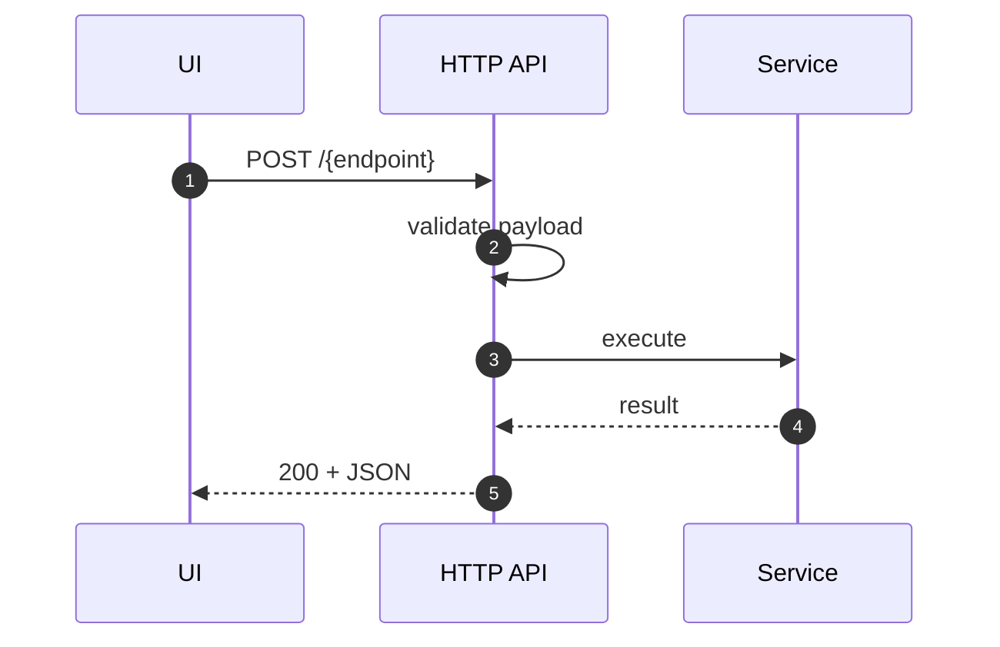

# API (HTTP)

Purpose & Responsibilities

Expose stable, versioned endpoints for refinement, proposal, validation, apply, inventory, and settings. Enforce schema validation on inputs/outputs.

Endpoints (v1)

- POST /refine → { refinedPrompt, studyPlan }
- POST /proposal → ProposalV1
- POST /validate → ValidationReport
- POST /apply → ApplyReceipt[]
- POST /inventory/scan → { changed_count, summary }
- GET/PUT /settings → settings; POST /settings/test-provider → { ok }

Cross-cutting Concerns

- Schema validation middleware; correlation_id propagation; error taxonomy to HTTP mapping; rate limiting for provider calls where applicable.

Observability

- Metrics: per-endpoint latency, error rates.
- Logs: correlation_id, endpoint, status_code, duration_ms.

Security Considerations

- Local-first server; CSRF protection for UI; input sanitation; no secret leakage.

Acceptance Criteria

- All inputs/outputs validate; endpoints documented; integration smoke tests.

Test Plan

- Supertest/HTTP tests for each endpoint; contract fixtures round-tripped.

Ready-to-Implement Checklist

- [ ] OpenAPI stub or typed contracts wired.
- [ ] Validation middleware in place.
- [ ] Basic error handling and logging.
- [ ] Smoke tests.

---

## End-to-end Information Flow (Request → Response)

1. Receive request
   - Assign/propagate `correlation_id`; parse JSON body.

2. Validate
   - Use Ajv-based middleware to validate request payloads; map schema errors to 400 with JSON Pointers.

3. Delegate
   - Call corresponding service (refinement, proposal, validation, apply, inventory, settings).

4. Serialize response
   - Ensure outputs conform to contracts; set appropriate status code and content-type.



## Examples (Error mapping)

```json
{
  "code": "SCHEMA_INVALID",
  "errors": [ { "path": "/frontmatter/status", "message": "must be one of [...]" } ]
}
```

## Observability (expanded)

- Metrics: `http_requests_total` (by route/code), `http_request_duration_ms` (histogram)
- Logs: `endpoint, correlation_id, status, duration_ms, code`

## Test Plan (expanded)

- Contract round-trip tests per endpoint.
- Error mapping verifies codes and HTTP statuses.

## Edge Cases & Decisions

- Unknown endpoints → 404 JSON with remediation link.
- Large bodies → max size with 413 response and guidance.

## Traceability

| Requirement Ref | Section in This Doc | Test/Fixture |
| --- | --- | --- |
| API endpoints (system-design §2.3) | Flow, Validation, Mapping | supertest specs |
