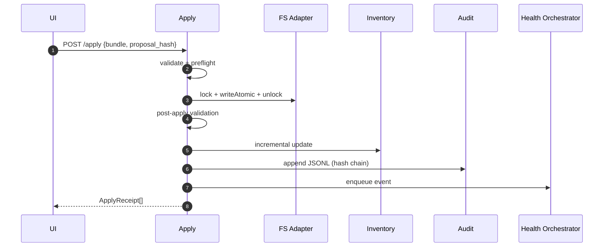

# Apply Service (Atomic Bundles)

Purpose & Responsibilities

Apply approved bundles atomically with per-path locks, fsync, rename, and post-apply validation. Update inventory and append audit.

Inputs / Outputs (Contracts)

- Input: `contracts/ApplyBundleV1.schema.json` (ApplyBundleV1), proposal_hash
- Output: ApplyReceipt[] (document in `contracts/ApplyReceipt.schema.json` if available)

Interfaces

- HTTP: POST /apply → ApplyReceipt[]
- Internal: FS adapter, Audit service, Inventory update, Health-check enqueue.

Failure Modes & Error Codes

- FS_NO_SPACE, FS_PERMISSION, PATH_COLLISION, CONFIG_CORRUPT.

Observability

- Metrics: bytes_written, fsync_durations_ms, post_validate_status.
- Logs: bundle_hash, per-file content_hash, paths affected.

Security Considerations

- Reject symlinks and traversal; deny cross-device rename; enforce `.md` extension for content files.

Acceptance Criteria

- ≤ 1 s/file (≤ 64 KB); idempotent by {bundle_hash, path, content_hash}; no partial writes; receipts returned or prior receipts on replay.

Test Plan

- Chaos tests around temp/rename; property tests for idempotency and replay; permission/no-space simulations.

Open Questions & Risks

- Cross-filesystem moves (explicitly unsupported initially).

Ready-to-Implement Checklist

- [ ] Locking and atomic write algorithm implemented.
- [ ] Idempotency guards in place.
- [ ] Post-apply validation wired.
- [ ] Audit append + health-check enqueue.
- [ ] Tests and chaos fixtures prepared.

---

## End-to-end Information Flow (ApplyBundleV1 → Receipts)

1. Receive request (POST /apply)
   - Input: `{ bundle: ApplyBundleV1, proposal_hash }`.
   - Normalize: validate schema; ensure paths are vault-relative, UTF-8, `.md` for content files.

2. Preflight checks
   - For each action: check PATH_COLLISION/permissions; confirm intent (create/modify/delete/link) against current inventory.

3. Acquire per-path locks
   - Create lock files `vault/.locks/<sha256(path)>.lock` (`O_EXCL`); fail fast if locked; stale locks older than TTL may be reclaimed with audit warning.

4. Atomic write per file (create/modify)
   - Write to `vault/.tmp/<uuid>`; `fsync(file)`; `fsync(tmp_dir)`; POSIX `rename(tmp→final)` on same device; `fsync(parent_dir)`.

5. Delete/link operations
   - Delete: rename to trash or direct unlink (per policy), then `fsync(parent_dir)`.
   - Link: update content to include/create links as specified; treat as modify with atomic write.

6. Post-apply validation
   - Re-validate changed files: frontmatter, required sections, route conformity.

7. Update inventory (incremental)
   - Recompute `vault.json` entries for changed paths (mtime, size, content_hash, topic, status, tags).

8. Append audit
   - Append AuditRecord with `{origin, justification, bundle_map, prev_hash}`; compute `record_hash` and link `prev_hash`.

9. Enqueue health-check
   - Post event with affected paths; orchestrator may coalesce.

10. Release locks & respond

    - Release all locks; return ApplyReceipt[] (per-file status, bytes_written, content_hash).



## Deterministic Algorithm (Step-by-step)

- Idempotency
  - Deduplicate actions by `{bundle_hash, path, content_hash}`; if identical replay, return prior receipts.
- Ordering
  - Process actions in stable order: deletes → creates → modifies → links to avoid transient collisions.
- Error handling
  - On any file error, abort remaining operations, roll back partial writes (temp cleanup), release locks, return partial receipts with failure codes.
- Receipts
  - Include `{ path, op, bytes_written, content_hash, status }` per action.

## Examples (Input/Output)

Example input (ApplyBundleV1 — create + link):

```json
{
  "bundle_hash": "aaaaaaaaaaaaaaaaaaaaaaaaaaaaaaaaaaaaaaaaaaaaaaaaaaaaaaaaaaaaaaaa",
  "actions": [
    {
      "op": "create",
      "path": "api/design/rest-vs-rpc-intro.md",
      "content": "---\ntitle: REST vs RPC: Concepts and Trade-offs\nstatus: draft\ntags: [api, rest, rpc]\n---\n\n# REST vs RPC\n\n## Summary\n...\n\n## References\n...",
      "content_hash": "bbbbbbbbbbbbbbbbbbbbbbbbbbbbbbbbbbbbbbbbbbbbbbbbbbbbbbbbbbbbbbbb"
    },
    {
      "op": "link",
      "path": "api/design/rest-vs-rpc-intro.md",
      "link_target": "notes/api/rest-vs-rpc.md"
    }
  ]
}
```

Example receipts:

```json
[
  { "path": "api/design/rest-vs-rpc-intro.md", "op": "create", "bytes_written": 1024, "content_hash": "bbbb...", "status": "ok" },
  { "path": "api/design/rest-vs-rpc-intro.md", "op": "link", "status": "ok" }
]
```

## Observability (expanded)

- Metrics
  - `apply_actions_total` (by op)
  - `apply_bytes_written_total`
  - `apply_fsync_duration_ms` (histogram)
  - `post_validate_failures_total`
- Logs
  - `correlation_id, bundle_hash, per_action{path,op,content_hash}, outcome`

## Security Considerations (expanded)

- Never follow symlinks; enforce normalized absolute path within vault.
- Deny cross-device renames; require same-device atomicity.
- Enforce `.md` extension policy for content files; other assets via explicit policy.

## Acceptance Criteria (expanded)

- Idempotent by `{bundle_hash, path, content_hash}`.
- No partial writes on failure; temp files cleaned.
- Post-apply validation and inventory update succeed or operation reported with failure.

## Test Plan (expanded)

- Chaos: kill between write and rename; verify no partials.
- Disk full simulation (`FS_NO_SPACE`); permission denied.
- Replays: submit same bundle twice; second returns prior receipts.
- Cross-device attempt triggers explicit error.

## Edge Cases & Decisions

- Renaming across devices is not supported initially; document ADR to add copy+fsync+replace if needed.
- Concurrent apply attempts serialize per-path via locks; global deadlocks avoided by stable path ordering.

## Ready-to-Implement Checklist

- [ ] Per-path lock implementation and TTL reclaim
- [ ] Atomic write path in FS adapter proven by tests
- [ ] Post-apply validator and inventory updater wired
- [ ] Audit append with hash chain + verifier
- [ ] Health-check enqueue on success

## Traceability

| Requirement Ref | Section in This Doc | Test/Fixture |
| --- | --- | --- |
| F3 Apply (requirements.md §3.2) | Information Flow, Algorithm, Tests | chaos tests, receipts fixtures |
| System Design §2.3.3 Apply | Atomic Write, Audit, Inventory, HC | unit/integration/perf |
