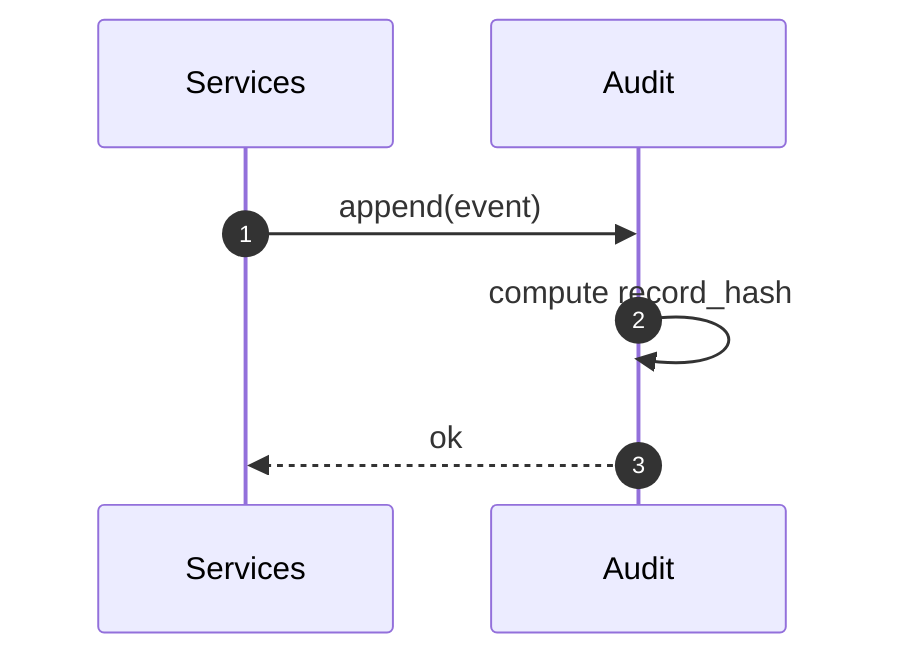

# Audit Service

Purpose & Responsibilities

Append-only JSONL log with hash chaining for tamper-evidence. Provide verification CLI to recompute chain.

Inputs / Outputs (Contracts)

- Input: Audit events {origin, justification, bundle_map, prev_hash}
- Output: `audit.log` entries conforming to `contracts/AuditRecord.schema.json`

Interfaces

- Internal: append logger; verifier CLI (separate script) to check chain.

Failure Modes & Error Codes

- FS_PERMISSION, IO_ERROR; chain verification failure.

Observability

- Metrics: append_latency_ms, fsync_ok, chain_verification_ok.

Security Considerations

- Redact sensitive data; never log secrets; ensure file permissions.

Acceptance Criteria

- Strictly append-only; verifier detects tampering; chain stable.

Test Plan

- Unit: hashing; append/rotate; verification.
- Integration: end-to-end with Apply receipts.

Open Questions & Risks

- Log rotation policy and archival.

Ready-to-Implement Checklist

- [ ] Record schema pinned.
- [ ] Verifier CLI stubbed.
- [ ] Append + fsync implemented.
- [ ] Tests and fixtures present.

---

## End-to-end Information Flow (Event → AuditRecord)

1. Receive event
   - Build record `{ ts, origin, justification, bundle_map, prev_hash }`.

2. Compute record_hash
   - `record_hash = sha256(canonical(record_without_record_hash))`.

3. Append JSONL
   - Append single-line JSON to `audit.log`; `fsync(file)` and optionally `fsync(parent_dir)`.

4. Rotation (optional)
   - If size/age threshold met, rotate with timestamp suffix and start fresh file; keep continuity by carrying last `record_hash` into next file header (documented policy).

5. Verification CLI
   - Read sequentially; recompute each `record_hash`; ensure it matches and `prev_hash` links to prior record.



## Deterministic Algorithm (Step-by-step)

- Canonicalization
  - Sort keys, UTF-8 encode, no insignificant whitespace.
- Hash chain
  - First record uses a fixed `prev_hash` seed (e.g., 64 zeros) documented in the verifier.
- Concurrency
  - Use file locking or append-only atomic writes (O_APPEND) to avoid interleaving.

## Examples (record)

```json
{
  "ts": "2025-09-29T10:00:00Z",
  "origin": "prompt",
  "justification": "User approved apply bundle",
  "bundle_map": { "api/design/rest-vs-rpc-intro.md": { "op": "create", "content_hash": "bbbb..." } },
  "prev_hash": "0000000000000000000000000000000000000000000000000000000000000000",
  "record_hash": "dddddddddddddddddddddddddddddddddddddddddddddddddddddddddddddddd"
}
```

## Observability (expanded)

- Metrics
  - `audit_append_latency_ms`
  - `audit_chain_ok` (gauge)
- Logs
  - `record_hash, prev_hash_truncated, origin, paths_count`

## Security Considerations (expanded)

- File permissions restricted to local user; no network transmission by default.
- Redact content from `bundle_map` if sensitive; include hashes/paths only.

## Acceptance Criteria (expanded)

- Verifier detects any tampering or truncation; chain remains valid across rotations per policy.

## Test Plan (expanded)

- Tamper test: modify a byte and ensure verifier fails.
- Truncation test: remove tail records and detect chain break.
- Rotation test: verify continuity across files.

## Edge Cases & Decisions

- Clock skew tolerated; ordering defined by append time; ts is informational.

## Ready-to-Implement Checklist

- [ ] Canonical serializer for records
- [ ] Append strategy with fsync
- [ ] Verifier CLI integrated into CI

## Traceability

| Requirement Ref | Section in This Doc | Test/Fixture |
| --- | --- | --- |
| F5 Audit Log (requirements.md §3.2) | Flow, Algorithm, Verifier | tamper/truncation fixtures |
| System Design §2.3.6 Audit | Observability, Acceptance | verifier CLI tests |
