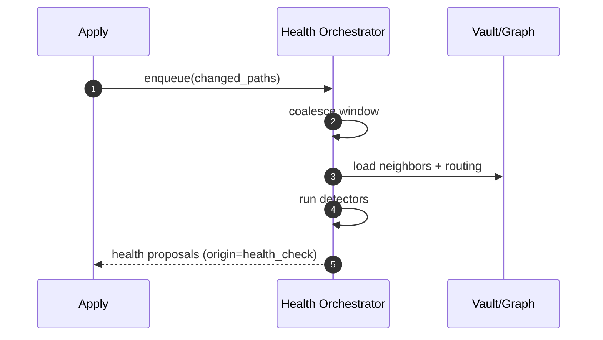

# Health Check Orchestrator

Purpose & Responsibilities

After Apply, coalesce events and run detectors for link gaps, orphans, topic sprawl, and required sections; emit health proposals (no writes).

Inputs / Outputs (Contracts)

- Inputs: recent change set, link graph, routing rules
- Outputs: ProposalV1 with origin=health_check

Interfaces

- Internal: queue/timer for coalescing; detectors; proposal emitter.

Failure Modes & Error Codes

- Cancelled (new prompt/apply), time budget exceeded.

Observability

- Metrics: detections_count by type, hc_latency_ms.
- Logs: affected_paths, thresholds hit, reasons.

Security Considerations

- Read-only; no direct writes to vault.

Acceptance Criteria

- Cancellable; produces proposals with clear reasons; respects time slices.

Test Plan

- Unit: detectors; cancellation behavior; threshold configuration.
- Integration: end-to-end with small fixture vault.

Open Questions & Risks

- Threshold defaults and per-route overrides.

Ready-to-Implement Checklist

- [ ] Detectors implemented and configurable.
- [ ] Coalescing/cancellation wired.
- [ ] Metrics and logs added.
- [ ] Fixtures and tests ready.

---

## End-to-end Information Flow (Apply → Health PROPOSALs)

1. Event intake
   - Receive post-apply events with changed paths; coalesce within a short window (e.g., 2 s).

2. Scope resolution
   - Build local scope: changed paths + inbound/outbound neighbors from link graph; load routing rules.

3. Detectors pipeline
   - Run detectors with time-sliced execution:
     - Broken links / orphans
     - Required sections missing (by route/template)
     - Topic sprawl (size_kb, max_headings, distinct_topics)
     - Neighbor rewrite opportunities (split/extract)

4. Proposal synthesis
   - For each detection, generate a ProposalV1 with `origin = "health_check"`, including `governance.rationale` and `related_links` to source notes.

5. Cancellation
   - If a new prompt or apply starts, cancel current run and reschedule after next change.

6. Emit results
   - Return one or more proposals (no writes); UI shows reasons and lets user approve or ignore.



## Deterministic Algorithm (Step-by-step)

- Coalescing
  - Fixed window (e.g., 2 s) to group bursts; stable ordering of paths.
- Time slicing
  - Slice long tasks to avoid blocking; checkpoint progress; respect budget.
- Proposal generation
  - Use consistent proposal structure; include concrete `target.path` suggestions when applicable.

## Examples (Health proposal)

Example ProposalV1 (split suggestion):

```json
{
  "version": 1,
  "id": "hc-20250929-split-abc",
  "origin": "health_check",
  "target": { "route_id": "api/design/deep", "path": "api/design/rest-split-1.md" },
  "frontmatter": { "title": "Split: REST Concepts (Part 1)", "status": "draft" },
  "body": { "content_md": "# Split: REST Concepts\n\n..." },
  "governance": {
    "related_links": ["api/design/too-large.md"],
    "rationale": "Topic sprawl: size_kb>64 and headings>12; propose split"
  },
  "hash": "cccccccccccccccccccccccccccccccccccccccccccccccccccccccccccccccc"
}
```

## Observability (expanded)

- Metrics
  - `hc_events_coalesced_total`
  - `hc_detections_total` (by type)
  - `hc_latency_ms`
- Logs
  - `changed_paths, detectors_run, proposals_emitted`

## Acceptance Criteria (expanded)

- Proposal rationales list thresholds hit and affected paths.
- Cancellation reliably halts work on new prompt/apply.

## Test Plan (expanded)

- Coalescing tests with rapid apply bursts.
- Detector unit tests with fixtures for broken links, missing sections, sprawl triggers.
- Cancellation test: start new prompt mid-run and assert halt.

## Edge Cases & Decisions

- Zero detections → emit none; log summary only.
- Overlapping detections → consolidate into fewer proposals when possible.

## Ready-to-Implement Checklist

- [ ] Coalesce window implemented and tunable
- [ ] Detectors produce structured findings
- [ ] Proposal synthesis stable and test-covered

## Traceability

| Requirement Ref | Section in This Doc | Test/Fixture |
| --- | --- | --- |
| F9 Health Checks (requirements.md §3.2) | Flow, Algorithm, Tests | detectors fixtures |
| System Design §2.3.5 HC Orchestrator | Observability, Acceptance | coalescing/cancel tests |
