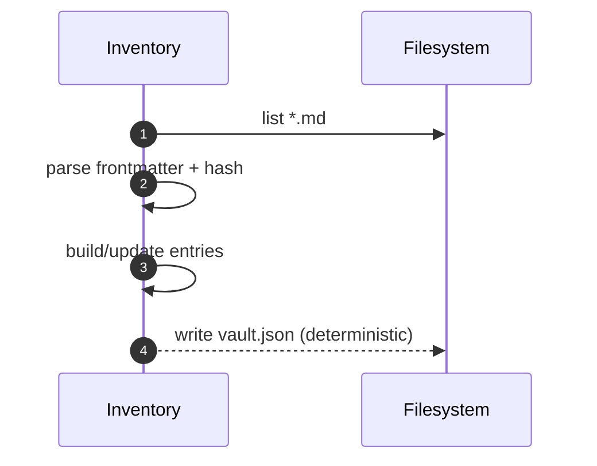

# Inventory & Reindex Service

Purpose & Responsibilities

Scan vault, parse frontmatter, maintain `vault.json`, compute content_hash, detect near-duplicates, and supply related_links.

Inputs / Outputs (Contracts)

- Inputs: Vault folder, Markdown files
- Outputs: `vault.json` entries conforming to `contracts/VaultEntry.schema.json`

Interfaces

- HTTP: POST /inventory/scan (full or incremental)
- Internal: FS adapter; watcher (incremental); duplicate detection heuristics.

Failure Modes & Error Codes

- FS_PERMISSION, CONFIG_CORRUPT.

Observability

- Metrics: files_per_sec, changed_count, duplicate_candidates.
- Logs: scan_window, errors, summary.

Security Considerations

- Respect file permissions; ignore non-UTF-8 paths; no traversal outside vault root.

Acceptance Criteria

- Full scan 5k ≤ 30 s; incremental ≤ 5 s; near-duplicate hints produced for within-topic overlaps.

Test Plan

- Synthetic trees for 5k files; checksum consistency; duplicate heuristics thresholds.

Open Questions & Risks

- Consider lightweight DB if > 5k files (ADR gate).

Ready-to-Implement Checklist

- [ ] Frontmatter parser selected and tested.
- [ ] Watcher implemented with debouncing.
- [ ] Perf harness present.
- [ ] Duplicate heuristics validated.

---

## End-to-end Information Flow (Vault → vault.json)

1. Start scan
   - Mode: full (walk all files) or incremental (changed paths from watcher).

2. Enumerate files
   - Filter to `.md`; reject non-UTF-8; skip hidden/system directories as configured.

3. Parse frontmatter & body
   - Extract `title, status, tags, aliases`; infer topic via routing where applicable; compute `content_hash` over normalized content; collect `mtime, size`.

4. Build/update entries
   - For full scan: rebuild map `{ path → VaultEntry }`.
   - For incremental: update changed paths only; keep stable ordering for serialization.

5. Duplicate detection (advisory)
   - Compute near-duplicate candidates per topic using `title` n-gram cosine and slug Levenshtein ≥ 0.82; emit suggestions to `related_links` or a report.

6. Serialize & persist
   - Write `vault.json` deterministically (sorted by path); `fsync` to ensure durability.



## Deterministic Algorithm (Step-by-step)

- Ordering
  - Sort entries by `path`. Serialize with stable key order.
- Hashing
  - `content_hash = sha256(normalized(frontmatter + body))` where normalization removes trailing spaces and standardizes line endings to `\n`.
- Topic inference (optional)
  - When routing is available, map `path` to `routes[].topic` for entry.topic.
- Incremental strategy
  - Debounce watcher events; coalesce within a short window; handle renames as delete+create.

## Examples (vault.json entries)

```json
[
  {
    "path": "api/design/rest-vs-rpc-intro.md",
    "title": "REST vs RPC: Concepts and Trade-offs",
    "topic": "api",
    "status": "draft",
    "tags": ["api", "rest", "rpc"],
    "mtime": 1759305600,
    "size": 2048,
    "content_hash": "bbbbbbbbbbbbbbbbbbbbbbbbbbbbbbbbbbbbbbbbbbbbbbbbbbbbbbbbbbbbbbbb"
  }
]
```

## Observability (expanded)

- Metrics
  - `inventory_scan_duration_ms` (full/incremental)
  - `inventory_files_scanned_total`
  - `inventory_changed_count`
  - `duplicate_candidates_total`
- Logs
  - `scan_mode, root, files_scanned, changed_count, duration_ms`

## Acceptance Criteria (expanded)

- Deterministic serialization; re-running on unchanged vault produces identical `vault.json` (hash stable).
- Performance targets: full 5k ≤ 30 s; incremental ≤ 5 s.

## Test Plan (expanded)

- Generate synthetic vaults with varying sizes and validate throughput.
- Verify determinism by hashing `vault.json` between runs with no changes.
- Validate duplicate detector thresholds and false-positive rate.

## Edge Cases & Decisions

- Non-UTF-8 files are skipped with warnings; no crashes.
- Large single files (> 64 KB) processed without blocking UI (run slice/yield strategy if needed).

## Ready-to-Implement Checklist

- [ ] Deterministic serializer
- [ ] Normalization rules for hashing
- [ ] Watcher debounce and coalescing
- [ ] Performance harness and fixtures

## Traceability

| Requirement Ref | Section in This Doc | Test/Fixture |
| --- | --- | --- |
| F4 Inventory & Reindex (requirements.md §3.2) | Information Flow, Algorithm | perf fixtures, determinism tests |
| System Design §2.3.4 Inventory | Observability, Acceptance | integration/perf tests |
