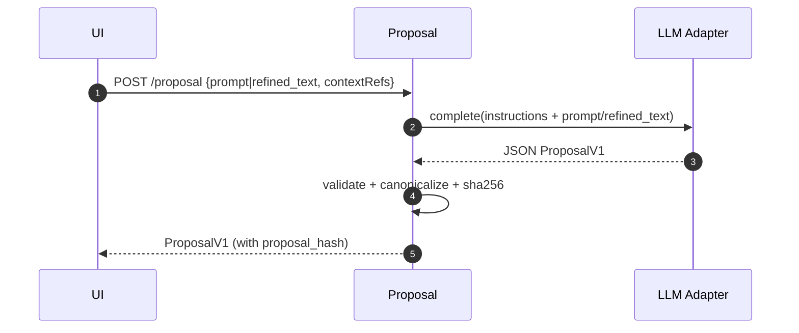

# Proposal Service

Purpose & Responsibilities

Generate ProposalV1 from prompt/context (or refined prompt), parse to schema, and compute proposal_hash over canonicalized JSON. Store last proposal snapshot.

Inputs / Outputs (Contracts)

- Input: `{ prompt: string, contextRefs?: string[] }` OR `{ refined_text: string }` (preferred). For backward compatibility, `{ refinedText: string }` MAY be accepted temporarily by an adapter layer.
- Output: `contracts/ProposalV1.schema.json` (ProposalV1)

Interfaces

- HTTP: POST /proposal → ProposalV1
- Internal: LLM adapter; canonical JSON serializer; audit linkage (proposal_hash).

Failure Modes & Error Codes

- LLM_TIMEOUT, LLM_429, LLM_MALFORMED; SCHEMA_INVALID on parsing; retry with capped backoff; format-repair loop ≤ 2.

Observability

- Metrics: proposal_latency_ms, retry_count, provider_code.
- Logs: correlation_id, proposal_id, proposal_hash, attempts.

Security Considerations

- Redact provider payloads; do not log secrets; enforce output schema.

Acceptance Criteria

- ≥ 95% responses parsed without manual edits; p90 ≤ 20 s; snapshot `.km_last_proposal.yaml` stored.

Test Plan

- Unit: parsing and canonicalization; hash stability.
- Integration: with mock LLM.
- Property: same prompt/context/model → stable proposal_hash.

Open Questions & Risks

- Model-specific formatting quirks; mitigation via repair prompts.

Ready-to-Implement Checklist

- [ ] Schema validation wired.
- [ ] Canonical serializer implemented.
- [ ] Retry/backoff and repair loop.
- [ ] Metrics/logs added.
- [ ] Tests and fixtures ready.

---

## End-to-end Information Flow (Prompt → ProposalV1)

1) Receive request (POST /proposal)
   - Input: `{ prompt: string, contextRefs?: string[] }` or `{ refined_text: string }` from the Refinement Service.
   - Normalize: trim strings, enforce UTF-8, limit contextRefs count/length, and dedupe.

2) Compose provider call
   - System content: strict instructions describing the ProposalV1 schema (names only) and rules (frontmatter, path, governance fields).
   - User content: the `prompt` or `refined_text` (normalized) plus any relevant `contextRefs`.

3) Call LLM (LLM adapter)
   - Enforce timeouts (p50 8 s, p90 16 s), retry/backoff on 429; cap at ≤ 2 attempts total.
   - Expect strict JSON adhering to ProposalV1.

4) Parse & validate (attempt 1)
   - Parse JSON; validate against ProposalV1 with Ajv (unknown keys rejected).
   - Enforce additional guards: target.path pattern, no traversal, `.md` extension.

5) Repair loop (attempt 2 if needed)
   - If validation fails, build a targeted repair instruction enumerating schema errors (JSON Pointers) and exact corrections.
   - Re-prompt once. If still invalid → return error details; do not write anything to disk.

6) Canonicalize & hash
   - Canonical JSON: stable key ordering, UTF-8 normalization, no insignificant whitespace.
   - Compute `proposal_hash = sha256(canonical(ProposalV1))` and set it in the returned object.

7) Optional snapshot
   - If enabled by settings, write a debug artifact `.km_last_proposal.yaml` under `km/` for operator review. This is not a content note and is excluded from Apply.

8) Respond
   - Log `{ correlation_id, proposal_id, proposal_hash, attempts }` and timings.
   - Return the validated ProposalV1.



## Deterministic Algorithm (Step-by-step)

- Inputs normalization
  - `prompt`/`refined_text`: string ≥ 8 chars; collapse whitespace. Normalize `{ refinedText }` → `{ refined_text }` if provided.
  - `contextRefs`: ≤ 8 items; strings; dedupe; may include vault-relative paths or URLs.

- Provider instruction strategy
  - Include concise schema summary and invariants (e.g., path must be `.md`, frontmatter fields, governance.rationale non-empty).
  - Emphasize: do not include Markdown fences; output compact JSON only.

- Strict parsing & validation
  - Parse JSON only; reject any prefixes/suffixes; unknown keys → error.
  - Ajv validation; collect errors `{ path, message }` for repair.

- Repair (single retry)
  - Feed exact schema errors back; forbid structural drift; keep same intent.

- Canonicalization & hashing
  - Canonicalize full ProposalV1; compute sha256 → hex string; assign to `hash`.

- Snapshot (optional)
  - Serialize to YAML and write to `km/.km_last_proposal.yaml` for operator visibility.

## Canonicalization & proposal_hash

- Canonical JSON rules
  - Sort object keys lexicographically at all levels.
  - Encode arrays in given order; strings as UTF-8; no trailing spaces or insignificant whitespace.
- Hashing
  - `proposal_hash = sha256(canonical(ProposalV1))` → 64-char hex.
  - Stable across processes and OSes when content-equivalent.

## Examples — Inputs and Outputs

Example input (prompt):

```json
{
  "prompt": "Create a new note that introduces REST vs RPC trade-offs and links to two reference resources.",
  "contextRefs": ["notes/api/rest-vs-rpc.md", "https://developer.mozilla.org/en-US/docs/Web/HTTP/Methods"]
}
```

Example input (refined):

```json
{
  "refined_text": "You are to generate a comprehensive ..."
}
```

Example output (ProposalV1 — create):

```json
{
  "version": 1,
  "id": "prop-20250928-rest-intro",
  "origin": "prompt",
  "target": {
    "route_id": "api/design/overview",
    "path": "api/design/rest-vs-rpc-intro.md"
  },
  "frontmatter": {
    "title": "REST vs RPC: Concepts and Trade-offs",
    "status": "draft",
    "tags": ["api", "rest", "rpc"],
    "aliases": ["rest-rpc-overview"]
  },
  "body": {
    "content_md": "# REST vs RPC\n\n## Summary\nConcise explanation...\n\n## References\n- [[notes/api/rest-vs-rpc]]\n- https://developer.mozilla.org/en-US/docs/Web/HTTP/Methods\n"
  },
  "governance": {
    "related_links": ["notes/api/rest-vs-rpc.md", "https://developer.mozilla.org/en-US/docs/Web/HTTP/Methods"],
    "rationale": "Introduce decision framework and connect to reference materials."
  },
  "hash": "0b9f5e3b7a9d2a5b1c4f0a2e6c1d7b8a9c0d1e2f3a4b5c6d7e8f9a0b1c2d3e4f"
}
```

Example output (ProposalV1 — enhancement, body-only):

```json
{
  "version": 1,
  "id": "prop-20250928-enhance-err-handling",
  "origin": "enhancement",
  "target": {
    "route_id": "api/design/deep",
    "path": "api/design/json-api-error-handling.md"
  },
  "frontmatter": {
    "title": "JSON API Error Handling",
    "status": "in-progress",
    "tags": ["api", "json", "errors"],
    "aliases": []
  },
  "body": {
    "content_md": "# JSON API Error Handling\n\nAdd examples for problem+json and consistent codes."
  },
  "governance": {
    "related_links": ["https://datatracker.ietf.org/doc/html/rfc7807"],
    "rationale": "Improve consistency with RFC 7807."
  },
  "hash": "7e2a8f0d4b39a1c9e5f0b2a1c3d4e5f6a7b8c9d0e1f2031425364758697a8b9c"
}
```

## Validation & Repair Details

- Enforce ProposalV1 strictly; enhancement proposals must not change frontmatter except status/tags unless explicitly allowed by UI flow.
- On failure, respond 400 with `{ code: "SCHEMA_INVALID", errors: [{ path, message }] }` and, if retry performed, include a `repair_guidance` summary.

## Emitted Metrics & Logs per Step

- Step 1: input_size_chars, context_count.
- Step 3: provider_latency_ms, retry_count, provider_code.
- Step 4/5: validation_error_count, repair_attempted (boolean).
- Step 6: canonicalization_ms, proposal_hash.
- Step 7: snapshot_written (boolean).

## Edge Cases & Decisions

- Non-JSON model output → single repair attempt; if still invalid, surface raw payload via copy-to-clipboard (redacted) for debugging.
- Overlong prompts or contexts → truncate with ellipses and include a note in rationale.
- Path collisions are not resolved here; Validation/Apply will block and propose alternatives.
- Proposal IDs: may be server-generated (slug-safe) to ensure uniqueness.
