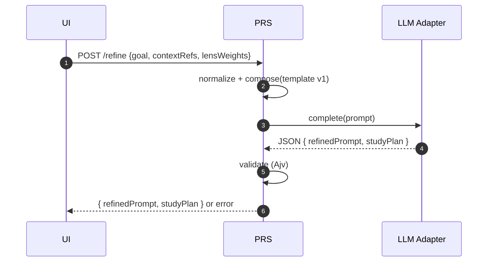

# Prompt Refinement Service

Purpose & Responsibilities

Convert a raw learning goal into a structured study plan and refined prompt for downstream proposal generation.Stateless, advisory-only (no writes to vault).

Inputs / Outputs (Contracts)

- Inputs: [PromptRefinementInput](/contracts/PromptRefinementInput.schema.json) ($id: PromptRefinementInput)
- Outputs: [RefinedPromptV1](/contracts/RefinedPromptV1.schema.json), [StudyPlanV1](/contracts/StudyPlanV1.schema.json)

Interfaces

- HTTP: POST /refine → { refinedPrompt: RefinedPromptV1, studyPlan: StudyPlanV1 }
- Query/body options:
  - autoStripAdditionalProps (boolean, optional): when true, the service will automatically strip any additional properties not declared in the schemas from the LLM output and, if the sanitized payloads validate, return them instead of throwing an error. Defaults from env REFINE_AUTO_STRIP_ADDITIONAL_PROPS.
- Internal: LLM adapter invocation with curriculum prompt; audit logging with origin=refinement.

Failure Modes & Error Codes

- LLM_TIMEOUT, LLM_429, LLM_MALFORMED; validation failure with actionable repair guidance.
- When autoStripAdditionalProps=true, additionalProperties violations are sanitized away and no error is thrown if the sanitized outputs validate.

Observability

- Metrics: refinement_latency_ms, plan_size_chars, refined_text_size, weights_distribution, refinement_success_rate.
- Logs: correlation_id, template_version, attempts, outcome.
- Debug file logging (LOG_LEVEL=debug): All LLM requests/responses/errors are appended as JSONL under logs/llm/.

Security Considerations

- Ephemeral outputs; redact sensitive fields in logs; no secrets persisted.

Acceptance Criteria

- Outputs strictly validate against schemas; ≤ 2 repair attempts; p90 ≤ 16 s.

Test Plan

- Unit: input validation, repair loop behavior.
- Integration: end-to-end POST /refine with mock provider.
- Performance: latency budget adherence.

Open Questions & Risks

- Template versioning and evolution policy.

Ready-to-Implement Checklist

- [ ] Schemas pinned and imported.
- [ ] Error taxonomy implemented.
- [ ] Metrics/logs integrated.
- [ ] Security review passed.
- [ ] Test fixtures defined.

---

## End-to-end Information Flow (Goal → StudyPlanV1, RefinedPromptV1)

1) Receive request (POST /refine)
   - Input: PromptRefinementInput `{ goal, contextRefs?, lensWeights? }`.
   - Normalize: trim strings, clamp weights to [0,1], default equal weights if missing.

2) Compose refinement prompt
   - Load system template: `design/prompts/curriculum-architect-template.md` (templateVersion = "curriculum-architect-v1").
   - Inject goal, contextRefs, and effective weights.

3) Call LLM (LLM adapter)
   - Enforce timeouts (p50 8 s, p90 16 s), retries/backoff for 429.
   - Expect strict JSON payload with fields `refinedPrompt` and `studyPlan`.

4) Parse & validate (attempt 1)
   - Parse JSON; validate `refinedPrompt` against RefinedPromptV1 and `studyPlan` against StudyPlanV1 (Ajv, strict).
   - On success: proceed to finalize.

5) Repair loop (attempt 2 if needed)
   - If validation fails, construct a targeted repair instruction that lists schema errors (paths + reasons).
   - Re-prompt once with the same template + repair guidance.
   - If still failing → return error with details; no vault writes.

6) Finalize & respond
   - Compute `inputs_fingerprint = sha256(canonical({goal, contextRefs, weights, templateVersion}))` for observability (not persisted in vault).
   - Log `{correlation_id, templateVersion, attempts, inputs_fingerprint}` and metrics.
   - Return `{ refinedPrompt, studyPlan }` to caller.

Note: No filesystem writes.The Proposal Service consumes `refinedPrompt.refined_text` later.



## Deterministic Algorithm (Step-by-step)

- Inputs normalization
  - goal: string ≥ 8 chars; collapse whitespace; keep UTF-8 only.
  - contextRefs: ≤ 8 items; strings; filter empties; de-duplicate.
  - lensWeights: clamp to [0,1]; if absent, distribute equally; store effective weights.

- Prompt construction
  - System message: curriculum-architect template (pin version).
  - Include strict output spec and schemas references (names, not full schema text).
  - Provide compact examples when helpful (never leak PII/secrets).

- LLM invocation
  - `timeoutMs`, `maxRetries` (for 429); `attempt` counter included in logs.

- Strict parsing & validation
  - Parse JSON only; reject Markdown code fences; unknown keys rejected.
  - Ajv validation for both payloads; collect error list with JSON Pointers.

- Repair strategy (single retry)
  - Feed back exact errors and required shapes; forbid structural changes beyond the schema.

- Finalization
  - Compute `inputs_fingerprint` (observability); set `refinedPrompt.templateVersion` to the template used; copy normalized `goal`.

## Example — Input and Outputs (compact)

Input (PromptRefinementInput):

```json
{
  "goal": "Learn REST API design fundamentals to build secure JSON APIs",
  "contextRefs": ["notes/api/rest-vs-rpc.md", "https://owasp.org/www-project-api-security/"],
  "lensWeights": { "tutor": 0.4, "publisher": 0.3, "student": 0.3 }
}
```

Output (RefinedPromptV1):

```json
{
  "version": 1,
  "id": "abcd-efgh",
  "refined_text": "You are to generate a comprehensive, structured learning proposal on REST API design fundamentals with a focus on building secure JSON APIs.",
  "lenses": { "tutor": 0.4, "publisher": 0.3, "student": 0.3 },
  "rationale": "Balances pedagogy, rigor, and accessibility",
  "constraints": []
}
```

Output (StudyPlanV1 — compact shape):

```json
{
  "version": 1,
  "id": "abcd-efgh",
  "overview": "Plan overview...",
  "parts": [
    {
      "title": "Foundations",
      "chapters": [
        {
          "title": "HTTP & REST",
          "modules": [
            {
              "title": "HTTP basics",
              "outcomes": ["Understand methods", "Status codes"],
              "routing_suggestions": [
                { "topic": "api", "folder": "fundamentals", "filename_slug": "http-basics", "tags": ["http", "rest"] }
              ]
            }
          ],
          "cross_links": ["notes/api/rest-vs-rpc.md"],
          "prereqs": [],
          "flags": { "foundational": true }
        }
      ],
      "meta": { "reflection": [], "synthesis": [] }
    }
  ]
}
```

Optional module routing_suggestions (example):

```json
{
  "title": "HTTP & REST Foundations",
  "description": "Principles of REST...",
  "topics": ["rest", "http-methods", "status-codes"],
  "resources": ["https://restfulapi.net/"],
  "routing_suggestions": [
    { "topic": "api", "folder": "design", "tags": ["ref/overview"], "filename_slug": "http-rest-foundations" }
  ]
}
```

## Validation & Repair Details

- Validation combines two schemas; both must pass or the request fails.
- On failure, return HTTP 400 with a machine-readable list `{ path, message, code: "SCHEMA_INVALID" }` and a human tip.
- During the single retry, the repair guidance includes the minimal diff needed (e.g., missing field, wrong enum) and an explicit list of additional_properties_to_remove with exact JSON Pointer-like paths when additionalProperties violations occur.
- Optional auto-strip: when `autoStripAdditionalProps=true` (query/body) or env `REFINE_AUTO_STRIP_ADDITIONAL_PROPS=true`, the service will strip additional properties and, if the sanitized payloads validate, return them instead of failing.

## Emitted Metrics & Logs per Step

- Step 1: `inputs_normalized=1` (log), goal_length, weights_distribution.
- Step 3: `refinement_attempt` counter; provider latency; retry_count.
- Step 4/5: validation_error_count; fields_missing; repair_attempted (boolean).
- Step 6: `refinement_latency_ms`, `plan_size_chars`, `refined_text_size`.

## Edge Cases & Decisions

- Extremely broad goals → return minimal viable plan with 3 modules and guidance to refine scope.
- Over-long resources list → truncate to 12 per schema.
- Missing weights → distribute equally; record distribution in `weights`.
- Non-JSON LLM output (e.g., Markdown) → hard fail with repair attempt; no best-effort parsing beyond JSON.

---

## Implementation Notes (v0.1.0)

- Language/Runtime: Node.js (>=18), TypeScript strict mode.
- HTTP Endpoint: POST `/refine` in local API (Express). Returns `{ refinedPrompt, studyPlan }`.
- Contracts: Ajv strict validation against `PromptRefinementInput`, `RefinedPromptV1`, `StudyPlanV1`.
- Prompt spec: The strict output specification embedded in the system prompt is rendered dynamically at runtime from the live JSON Schemas to avoid drift; the system prompt text is stored at `design/prompts/refinement-llm-system-prompt.md` and loaded at runtime (with a graceful fallback string).
- DI & Adapters: `LLMAdapter` interface with `MockLLMAdapter` default for local/offline tests.
- Repair Loop: Single retry with targeted guidance using Ajv error pointers and explicit additional-properties paths.
- Timeouts/Backoff: 8 s default timeout; single retry for 429 with jittered backoff.
- Security: Inputs validated, outputs ephemeral, logs redacted (no payloads), no persistence.
- Observability: Pino JSON logs with `correlation_id`; Prometheus metrics `/metrics`; JSONL LLM logs under `logs/llm` in debug mode.

## Runbook (Local)

- Start service: `npm run dev` (dev) or `npm start` (built). Default port 3030.
- Health: `GET /health` → `{ ok: true }`.
- Metrics: `GET /metrics` (Prometheus format). Key series: `refinement_latency_ms`, `refined_text_size`, `plan_size_chars`, `refinement_success_total`, `refinement_failure_total`.
- Request example:
  - POST `/refine?autoStripAdditionalProps=true` with `Content-Type: application/json` and body matching `PromptRefinementInput`.
  - Or include `{ options: { autoStripAdditionalProps: true } }` wrapper in body.
- Env defaults:
  - `REFINE_AUTO_STRIP_ADDITIONAL_PROPS` (default false). When true, behaves as if the query/body flag were set.
- Logs: Structured JSON to stdout; include `correlation_id`, `action`, `duration_ms`.
- Failure handling:
  - `SCHEMA_INVALID` → HTTP 400 with Ajv pointers under `details`.
  - `LLM_TIMEOUT`/`LLM_429`/`LLM_MALFORMED` → HTTP 502 with `retryable` flag.

## Traceability

- Maps to System Design §2.3.0 (Prompt Refinement Service), §3.0 contracts, §6 error taxonomy, §9 observability.
- Tests reference acceptance criteria: schema-conformant outputs; ≤ 2 attempts.
