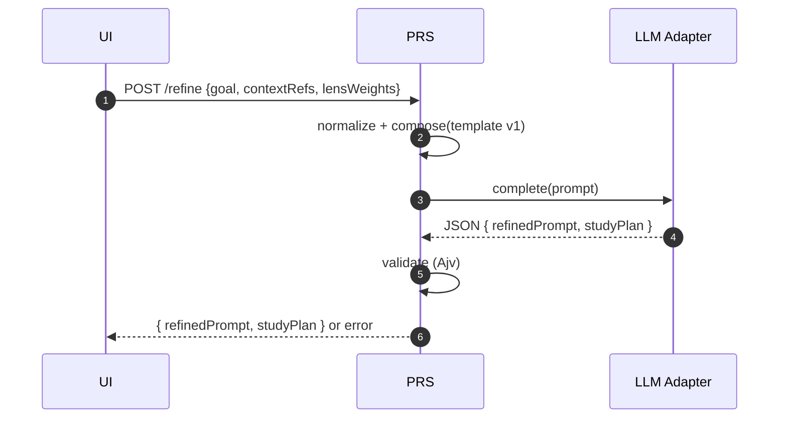

# Prompt Refinement Service

Purpose & Responsibilities

Convert a raw learning goal into a structured study plan and refined prompt for downstream proposal generation. Stateless, advisory-only (no writes to vault).

Inputs / Outputs (Contracts)

- Inputs: [PromptRefinementInput](/contracts/PromptRefinementInput.schema.json) ($id: PromptRefinementInput)
- Outputs: [RefinedPromptV1](/contracts/RefinedPromptV1.schema.json), [StudyPlanV1](/contracts/StudyPlanV1.schema.json)

Interfaces

- HTTP: POST /refine → { refinedPrompt: RefinedPromptV1, studyPlan: StudyPlanV1 }
- Internal: LLM adapter invocation with curriculum prompt; audit logging with origin=refinement.

Failure Modes & Error Codes

- LLM_TIMEOUT, LLM_429, LLM_MALFORMED; validation failure with actionable repair guidance.

Observability

- Metrics: refinement_latency_ms, plan_size_chars, refined_text_size, weights_distribution, refinement_success_rate.
- Logs: correlation_id, template_version, attempts, outcome.

Security Considerations

- Ephemeral outputs; redact sensitive fields in logs; no secrets persisted.

Acceptance Criteria

- Outputs strictly validate against schemas; ≤ 2 repair attempts; p90 ≤ 16 s.

Test Plan

- Unit: input validation, repair loop behavior.
- Integration: end-to-end POST /refine with mock provider.
- Performance: latency budget adherence.

Open Questions & Risks

- Template versioning and evolution policy.

Ready-to-Implement Checklist

- [ ] Schemas pinned and imported.
- [ ] Error taxonomy implemented.
- [ ] Metrics/logs integrated.
- [ ] Security review passed.
- [ ] Test fixtures defined.

---

## End-to-end Information Flow (Goal → StudyPlanV1, RefinedPromptV1)

1) Receive request (POST /refine)
   - Input: PromptRefinementInput `{ goal, contextRefs?, lensWeights? }`.
   - Normalize: trim strings, clamp weights to [0,1], default equal weights if missing.

2) Compose refinement prompt
   - Load system template: `design/prompts/curriculum-architect-template.md` (templateVersion = "curriculum-architect-v1").
   - Inject goal, contextRefs, and effective weights.

3) Call LLM (LLM adapter)
   - Enforce timeouts (p50 8 s, p90 16 s), retries/backoff for 429.
   - Expect strict JSON payload with fields `refinedPrompt` and `studyPlan`.

4) Parse & validate (attempt 1)
   - Parse JSON; validate `refinedPrompt` against RefinedPromptV1 and `studyPlan` against StudyPlanV1 (Ajv, strict). 
   - On success: proceed to finalize.

5) Repair loop (attempt 2 if needed)
   - If validation fails, construct a targeted repair instruction that lists schema errors (paths + reasons). 
   - Re-prompt once with the same template + repair guidance. 
   - If still failing → return error with details; no vault writes.

6) Finalize & respond
   - Compute `inputs_fingerprint = sha256(canonical({goal, contextRefs, weights, templateVersion}))` for observability (not persisted in vault). 
   - Log `{correlation_id, templateVersion, attempts, inputs_fingerprint}` and metrics.
   - Return `{ refinedPrompt, studyPlan }` to caller.

Note: No filesystem writes. The Proposal Service consumes `refinedPrompt.refinedText` later.



## Deterministic Algorithm (Step-by-step)

- Inputs normalization
  - goal: string ≥ 8 chars; collapse whitespace; keep UTF-8 only.
  - contextRefs: ≤ 8 items; strings; filter empties; de-duplicate.
  - lensWeights: clamp to [0,1]; if absent, distribute equally; store effective weights.

- Prompt construction
  - System message: curriculum-architect template (pin version). 
  - Include strict output spec and schemas references (names, not full schema text). 
  - Provide compact examples when helpful (never leak PII/secrets).

- LLM invocation
  - `timeoutMs`, `maxRetries` (for 429); `attempt` counter included in logs.

- Strict parsing & validation
  - Parse JSON only; reject Markdown code fences; unknown keys rejected. 
  - Ajv validation for both payloads; collect error list with JSON Pointers.

- Repair strategy (single retry)
  - Feed back exact errors and required shapes; forbid structural changes beyond the schema.

- Finalization
  - Compute `inputs_fingerprint` (observability); set `refinedPrompt.templateVersion` to the template used; copy normalized `goal`.

## Example — Input and Outputs (compact)

Input (PromptRefinementInput):

```json
{
  "goal": "Learn REST API design fundamentals to build secure JSON APIs",
  "contextRefs": ["notes/api/rest-vs-rpc.md", "https://owasp.org/www-project-api-security/"],
  "lensWeights": { "tutor": 0.4, "publisher": 0.3, "student": 0.3 }
}
```

Output (RefinedPromptV1):

```json
{
    "version": 1,
    "goal": "Learn REST API design fundamentals to build secure JSON APIs",
    "refinedText": "You are to generate a comprehensive, structured learning proposal on REST API design fundamentals with a focus on building secure JSON APIs. Organize the material into a progressive study path that starts with HTTP and REST basics, moves through design principles and standards, covers authentication and authorization models, emphasizes API security practices (e.g., OWASP API Top 10), and concludes with documentation and testing strategies. Ensure the proposal balances pedagogical clarity (as a tutor), scientific rigor with established categories and terminology (as a publisher), and cognitive accessibility with practical examples and reflection points (as a student). Draw connections to existing references such as REST vs RPC debates and the OWASP API Security project. The output should be modular, indexed, and usable for both study and reference.",
    "weights": { "tutor": 0.4, "publisher": 0.3, "student": 0.3 },
    "templateVersion": "curriculum-architect-v1"
  }
```

Output (StudyPlanV1 — 3 modules shown):

```json
{
    "version": 1,
    "goal": "Learn REST API design fundamentals to build secure JSON APIs",
    "modules": [
        {
            "title": "Foundations of REST and HTTP",
            "description": "Introduce the principles of REST architecture and the core mechanisms of HTTP as the backbone for JSON APIs.",
            "topics": ["HTTP methods", "status codes", "REST constraints", "statelessness", "resource identification"],
            "resources": [
                "https://developer.mozilla.org/en-US/docs/Web/HTTP/Overview",
                "https://restfulapi.net/",
                "notes/api/rest-vs-rpc.md"
            ],
            "routing_suggestions": [
                { "topic": "api", "folder": "fundamentals", "tags": ["http", "rest", "architecture"], "filename_slug": "rest-http-foundations" }
            ]
        },
        {
            "title": "Designing JSON APIs",
            "description": "Cover the fundamentals of designing clean, intuitive, and consistent JSON APIs.",
            "topics": ["resource modeling", "naming conventions", "versioning strategies", "error handling", "HATEOAS"],
            "resources": [
                "https://cloud.google.com/apis/design",
                "https://jsonapi.org/"
            ],
            "routing_suggestions": [
                { "topic": "api", "folder": "design", "tags": ["json", "best-practices"], "filename_slug": "json-api-design" }
            ]
        },
        {
            "title": "Authentication and Authorization",
            "description": "Explore methods to securely control access to APIs and user data.",
            "topics": ["API keys", "OAuth 2.0", "JWT", "OpenID Connect", "role-based access control"],
            "resources": [
                "https://oauth.net/2/",
                "https://jwt.io/introduction"
            ],
            "routing_suggestions": [
                { "topic": "api", "folder": "security", "tags": ["auth", "jwt", "oauth2"], "filename_slug": "api-authentication-authorization" }
            ]
        }
    ]
}
```

Optional module routing_suggestions (example):

```json
{
  "title": "HTTP & REST Foundations",
  "description": "Principles of REST...",
  "topics": ["rest", "http-methods", "status-codes"],
  "resources": ["https://restfulapi.net/"],
  "routing_suggestions": [
    { "topic": "api", "folder": "design", "tags": ["ref/overview"], "filename_slug": "http-rest-foundations" }
  ]
}
```

## Validation & Repair Details

- Validation combines two schemas; both must pass or the request fails.
- On failure, return HTTP 400 with a machine-readable list `{ path, message, code: "SCHEMA_INVALID" }` and a human tip. 
- During the single retry, the repair guidance includes the minimal diff needed (e.g., missing field, wrong enum). 

## Emitted Metrics & Logs per Step

- Step 1: `inputs_normalized=1` (log), goal_length, weights_distribution. 
- Step 3: `refinement_attempt` counter; provider latency; retry_count. 
- Step 4/5: validation_error_count; fields_missing; repair_attempted (boolean). 
- Step 6: `refinement_latency_ms`, `plan_size_chars`, `refined_text_size`.

## Edge Cases & Decisions

- Extremely broad goals → return minimal viable plan with 3 modules and guidance to refine scope. 
- Over-long resources list → truncate to 12 per schema. 
- Missing weights → distribute equally; record distribution in `weights`. 
- Non-JSON LLM output (e.g., Markdown) → hard fail with repair attempt; no best-effort parsing beyond JSON.
