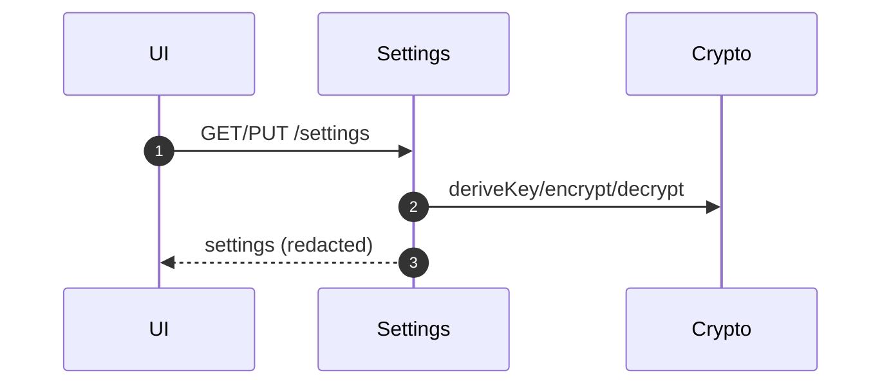

# Settings Service

Purpose & Responsibilities

Manage settings.json with encrypted fields (Argon2id → AES-256-GCM). Provide provider connectivity test.

Inputs / Outputs (Contracts)

- Input/Output: settings JSON with metadata for KDF params and encryption version.

Interfaces

- HTTP: GET/PUT /settings; POST /settings/test-provider
- Internal: Crypto adapter for KDF and encryption/decryption.

Failure Modes & Error Codes

- CONFIG_CORRUPT, FS_PERMISSION, PROVIDER_UNAVAILABLE.

Observability

- Metrics: encryption_version, kdf_params, test_call_status.
- Logs: status codes only; never secrets.

Security Considerations

- Encrypt secrets at rest; redact; protect files with OS permissions.

Acceptance Criteria

- Round-trip encrypt/decrypt; test provider endpoint; no secret leakage in logs.

Test Plan

- Unit: KDF/encrypt/decrypt; corrupt file recovery path.
- Integration: provider test call stubs.

Open Questions & Risks

- Rotation UI/flows.

Ready-to-Implement Checklist

- [ ] Crypto adapter integrated.
- [ ] Redaction rules in logs.
- [ ] Tests for rotation and corruption.

---

## End-to-end Information Flow (Settings CRUD)

1. Read settings (GET /settings)
   - Load file; decrypt protected fields using derived key; redact secrets in response.

2. Update settings (PUT /settings)
   - Validate schema; derive key (Argon2id) as needed; encrypt secret fields with AES-256-GCM; write file with `fsync`.

3. Test provider (POST /settings/test-provider)
   - Use decrypted provider credentials; call adapter test endpoint; return status only (no credentials echoed).



## Deterministic Algorithm (Step-by-step)

- KDF params
  - Default Argon2id: m=64MiB, t=3, p=1; store salt and params alongside ciphertext metadata.
- Encryption
  - AES-256-GCM; random 96-bit nonce; store `{nonce, tag, ciphertext}`; use authenticated decryption.
- Rotation
  - On passphrase change: decrypt old, re-encrypt new; atomically replace file.

## Examples (settings.json — redacted)

```json
{
  "encryption_version": 1,
  "kdf": { "algo": "argon2id", "m": 65536, "t": 3, "p": 1, "salt": "base64..." },
  "providers": {
    "gemini": {
      "api_key": { "nonce": "base64...", "tag": "base64...", "ciphertext": "base64..." },
      "model": "gemini-2.5-pro"
    }
  }
}
```

## Observability (expanded)

- Metrics: `settings_rotate_success_total`, `settings_test_call_status`.
- Logs: `encryption_version, kdf_params_summary, test_status` (no secrets).

## Acceptance Criteria (expanded)

- On corruption, service reports `CONFIG_CORRUPT` and provides recovery guidance.
- No secrets printed or logged.

## Test Plan (expanded)

- Corrupt file recovery fixture (bad tag/nonce) → decryption fails clearly.
- Rotation path test: re-encrypt with new passphrase and verify decrypt.

## Edge Cases & Decisions

- Missing settings file → generate minimal template and require user action to complete.

## Ready-to-Implement Checklist

- [ ] Schema for settings file
- [ ] Crypto defaults and metadata format documented
- [ ] Rotation command and tests

## Traceability

| Requirement Ref | Section in This Doc | Test/Fixture |
| --- | --- | --- |
| F6 Settings & Providers (requirements.md §3.2) | Flow, Security, Tests | encryption fixtures, test-provider |
| System Design §2.3.7 Settings | Observability, Acceptance | unit/integration tests |
