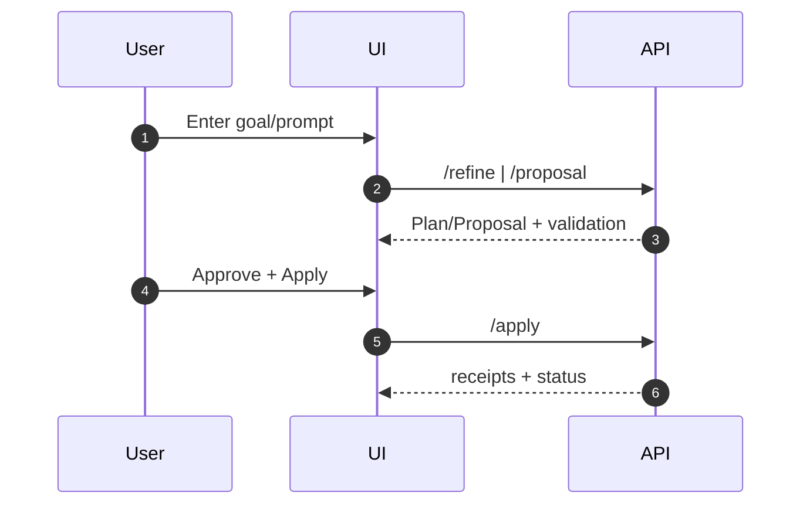

# UI (Next.js/React)

Purpose & Responsibilities

Provide accessible, local-first web interface for refinement, proposal review, validation feedback, apply flow, audit viewer, and settings.

Primary Screens

- Prompt Refinement (two-pane)
- Proposal Viewer & Validator (diffs, route match explanations)
- Apply Confirmation (checkbox + modal, receipts)
- Inventory/Reindex status
- Audit Log viewer
- Settings (provider test)

Accessibility & UX

- WCAG 2.1 AA baseline; keyboard-first; ARIA live regions for validation errors and success; visible focus states.

Observability

- Logs (client-side) limited; send correlation_id; basic performance timings.

Security Considerations

- CSRF tokens; input sanitation; do not render secrets.

Acceptance Criteria

- All core flows operable via keyboard; validation errors clearly announced; consistent error texts.

Test Plan

- Accessibility smoke tests (axe-core); component unit tests; basic E2E for core flows.

Ready-to-Implement Checklist

- [ ] Routing and page structure defined.
- [ ] A11y checks integrated.
- [ ] Error states and empty states designed.
- [ ] E2E smoke tests scripted.

---

## End-to-end Information Flow (User → Apply)

1. Refinement
   - User enters goal; sees study plan and refined prompt; adjusts weights.

2. Proposal
   - User submits prompt/refined text; sees ProposalV1 with schema validation status and route explanation.

3. Approval & Apply
   - User checks confirmation and applies; receives per-file receipts; UI triggers health-check status updates.



## Examples (A11y announcements)

```text
Validation error: frontmatter.status must be one of [draft, in-progress, review, published, archived].
```

## Observability (expanded)

- Metrics: `ui_page_load_ms`, `ui_form_submit_ms`, `ui_a11y_violations_total`
- Logs: `correlation_id, route, action`

## Test Plan (expanded)

- Axe-core checks on key pages.
- Keyboard-only navigation flows.
- Error-state rendering and announcements.

## Edge Cases & Decisions

- Offline state surfaces read-only info and local validation but disables provider calls.

## Traceability

| Requirement Ref | Section in This Doc | Test/Fixture |
| --- | --- | --- |
| Accessibility (requirements.md §4) | A11y, Test Plan | axe-core specs |
| Core flows (system-design §2.4) | Information Flow | E2E smoke |
