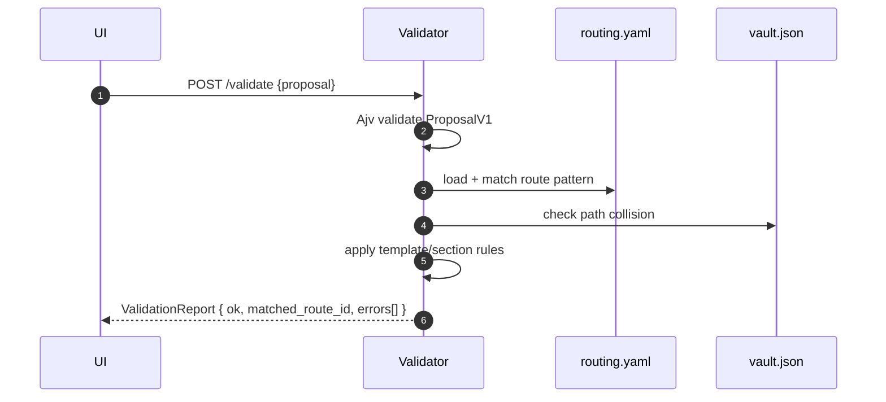

# Validation Service

Purpose & Responsibilities

Validate ProposalV1 against routing.yaml and vault.json. Ensure route match, path policy, frontmatter rules, and enhancement is body-only.

Inputs / Outputs (Contracts)

- Inputs: ProposalV1, `km/routing.yaml`, `vault.json`
- Output: `contracts/ValidationReport.schema.json` (ValidationReport)

Interfaces

- HTTP: POST /validate → ValidationReport
- Internal: pattern matching (glob), frontmatter checks, required_sections enforcement.

Failure Modes & Error Codes

- SCHEMA_INVALID, ROUTING_MISMATCH, PATH_COLLISION, ROUTING_TEMPLATE_UNKNOWN, ROUTING_REQUIRED_SECTIONS_MISSING.

Observability

- Metrics: validation_duration_ms, error_count, warning_count.
- Logs: matched_route_id, ruleIds, errors[].code.

Security Considerations

- Path normalization and traversal rejection; strict schema validation.

Acceptance Criteria

- Pure function; deterministic for same inputs; completes ≤ 2 s.

Test Plan

- Unit: pattern conflict detection; template existence; required_sections.
- Fixtures: overlapping patterns, missing templates, minimal valid routing.

Open Questions & Risks

- Precedence policy when multiple patterns match.

Ready-to-Implement Checklist

- [ ] Glob matcher selected and tested.
- [ ] Error taxonomy mapped.
- [ ] Fixtures prepared.
- [ ] Determinism checks added.

---

## End-to-end Information Flow (ProposalV1 → ValidationReport)

1. Receive request (POST /validate)
   - Inputs: `{ proposal: ProposalV1 }`, plus server-side access to `km/routing.yaml` and `vault.json`.
   - Normalize: enforce UTF-8, trim strings, canonicalize path separators in `proposal.target.path` for evaluation.

2. Schema validation (ProposalV1)
   - Validate the incoming ProposalV1 with Ajv (strict, unknown keys rejected). If invalid → `SCHEMA_INVALID` with pointers; stop.

3. Route matching
   - Evaluate `routing.routes[].pattern` (glob) against `proposal.target.path` using a deterministic matcher.
   - If multiple match: resolve by configured precedence rule (specificity > id order, or explicit precedence if defined). If unresolved → `ROUTING_PATTERN_CONFLICT`.
   - If none match → `ROUTING_MISMATCH`.

4. Route constraints & template checks
   - Ensure referenced `template` exists in `routing.schemas.templates`; else `ROUTING_TEMPLATE_UNKNOWN`.
   - If the route or template defines `required_sections`, verify the note body contains the headings; else `ROUTING_REQUIRED_SECTIONS_MISSING`.

5. Path policy & collisions
   - Normalize path within vault root; reject traversal (`..`) and non-`.md` extensions; check collision against `vault.json`.
   - If target exists and action implies create (not modify) → `PATH_COLLISION`.

6. Frontmatter & enhancement policy
   - Enforce frontmatter required fields per `routing.schemas.frontmatter`.
   - For `origin = "enhancement"`, ensure changes are body-only (frontmatter unchanged unless explicitly allowed by UI flow). If violated → `FM_UNCHANGED` error.

7. Links and neighbors (advisory)
   - Optionally verify `governance.related_links` exist in vault or are well-formed URIs; warn if missing.

8. Emit report
   - Aggregate findings into `ValidationReport { ok, matched_route_id, errors[] }`; `ok = false` if any error-level findings.



## Deterministic Algorithm (Step-by-step)

- Inputs normalization
  - Normalize path separators to `/`; reject NUL/invalid UTF-8.
- Route matching and precedence
  - Use a stable matcher (e.g., minimatch with explicit options). If multiple matches, compute specificity (longer fixed prefix, fewer wildcards); tie-break by `routes[].id` lexicographic order unless a precedence config is present.
- Template/sections enforcement
  - Map from route → template; ensure template exists; scan `body.content_md` headings to satisfy `required_sections`.
- Frontmatter and policy
  - Enforce required/optional/enums per `routing.schemas.frontmatter`.
  - For `origin="enhancement"`, diff frontmatter vs inventory to ensure unchanged; only body can change.
- Path collision
  - Check `vault.json` for existing entry at path; classify intent (create/modify) from higher layer or infer by existence and origin.
- Output stability
  - Sort `errors[]` by `severity desc, code asc, path asc` for deterministic output.

## Failure Modes & Error Codes (expanded)

- `SCHEMA_INVALID` — ProposalV1 failed schema; remediation: fix fields indicated by JSON Pointers.
- `ROUTING_MISMATCH` — No route matched path; remediation: adjust route or provide routing snippet in Proposal.
- `ROUTING_PATTERN_CONFLICT` — Multiple patterns ambiguous; remediation: define precedence or refine patterns.
- `ROUTING_TEMPLATE_UNKNOWN` — Route template missing; remediation: add template under `schemas.templates`.
- `ROUTING_REQUIRED_SECTIONS_MISSING` — Body missing required headings; remediation: add required sections.
- `PATH_COLLISION` — Target exists for create; remediation: choose modify or different path.
- `FM_UNCHANGED` — Enhancement attempted frontmatter changes; remediation: restrict to body-only or switch flow.

## Observability

- Metrics
  - `validation_duration_ms`
  - `validation_errors_total` (by code)
  - `route_match_ambiguities_total`
- Logs (structured JSON)
  - `correlation_id, matched_route_id, path, errors[{code,path,severity}], ruleIds`

## Security Considerations

- Never evaluate or follow external links; only syntactic checks.
- Reject paths outside vault root; treat symlinks as invalid at this stage (FS adapter enforces at write time).
- Validation is read-only; no writes to disk.

## Acceptance Criteria (expanded)

- Deterministic output given identical inputs (`errors[]` ordering stable).
- Completes ≤ 2 s for typical proposals; ≤ 300 ms common case.
- Accurately identifies conflicts and missing requirements with machine-readable codes and human messages.

## Test Plan (expanded)

- Unit tests
  - Valid/invalid ProposalV1 schema cases (missing fields, wrong enums).
  - Pattern matching: single match, no match, ambiguous match → conflict.
  - Template/required_sections presence scanning.
  - Frontmatter unchanged for enhancements.
- Fixtures (under `tests/fixtures/validation/`)
  - `proposal-valid.json`, `proposal-missing-section.json`, `proposal-bad-path.json`
  - `routing-minimal.yaml`, `routing-overlap.yaml`, `routing-missing-template.yaml`
  - `vault-sample.json` with and without target path
- Property tests
  - Determinism of `errors[]` ordering given shuffled inputs.
- Performance
  - Measure `validation_duration_ms` across 100 proposals and assert p90 ≤ 2 s on CI runner baseline.

## Examples (Input/Output)

Example input (ProposalV1 — minimal create):

```json
{
  "version": 1,
  "id": "prop-abc123",
  "origin": "prompt",
  "target": { "route_id": "topic/example", "path": "topic/example/2025-01-01-intro.md" },
  "frontmatter": { "title": "Intro", "status": "draft" },
  "body": { "content_md": "# Intro\n\n## Summary\n...\n\n## References\n..." },
  "governance": { "related_links": [], "rationale": "First note" },
  "hash": "aaaaaaaaaaaaaaaaaaaaaaaaaaaaaaaaaaaaaaaaaaaaaaaaaaaaaaaaaaaaaaaa"
}
```

Example output (ValidationReport — ok):

```json
{
  "ok": true,
  "matched_route_id": "topic/example",
  "errors": []
}
```

Example output (ValidationReport — errors):

```json
{
  "ok": false,
  "matched_route_id": "topic/example",
  "errors": [
    {
      "code": "ROUTING_REQUIRED_SECTIONS_MISSING",
      "path": "/body/content_md",
      "message": "Missing required section heading: References",
      "severity": "error",
      "ruleId": "req-sections:study_note"
    },
    {
      "code": "PATH_COLLISION",
      "path": "/target/path",
      "message": "Path already exists; choose modify or different path",
      "severity": "error"
    }
  ]
}
```

## Edge Cases & Decisions

- Multiple overlapping patterns with equal specificity → flag conflict; do not guess.
- Unicode headings in body → normalize to NFC for heading detection.
- Empty `related_links` is allowed; missing `rationale` is not.

## Ready-to-Implement Checklist

- [ ] Ajv validators wired (ProposalV1, ValidationReport construction)
- [ ] Stable glob matcher with precedence rules
- [ ] Section scanner implemented (headings)
- [ ] Frontmatter unchanged guard for enhancements
- [ ] Deterministic error ordering
- [ ] Unit/fixture/perf tests in CI

## Traceability

| Requirement Ref | Section in This Doc | Test/Fixture |
| --- | --- | --- |
| F2 PROPOSAL Validator (requirements.md §3.2) | Acceptance Criteria, Test Plan | tests/fixtures/validation/* |
| System Design §2.3.2 Validation Service | Information Flow, Algorithm | unit and integration specs |
