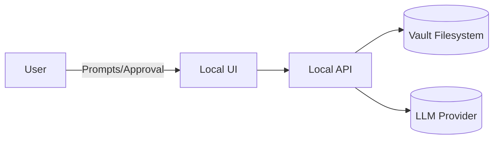
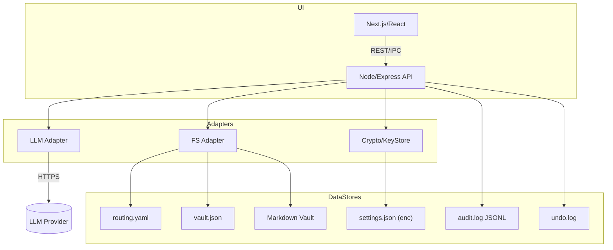
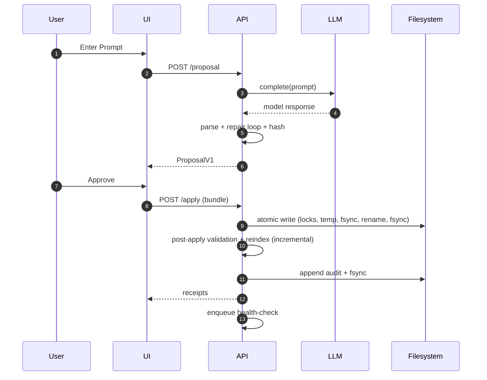
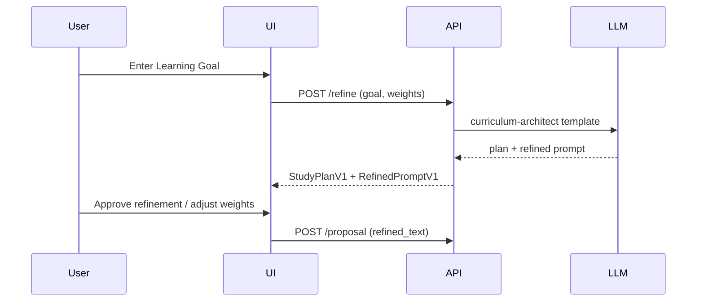
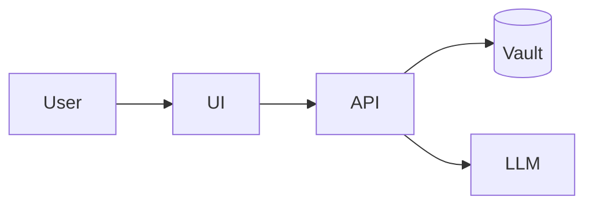
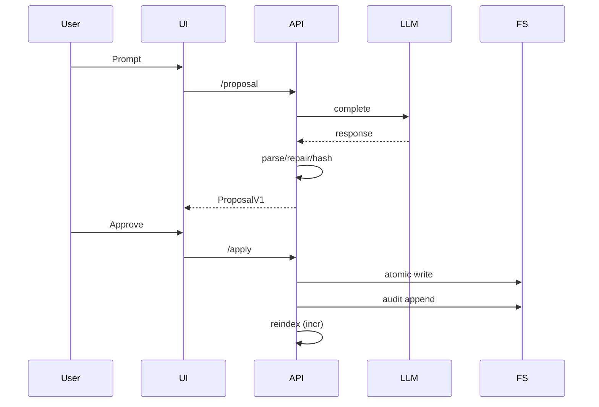
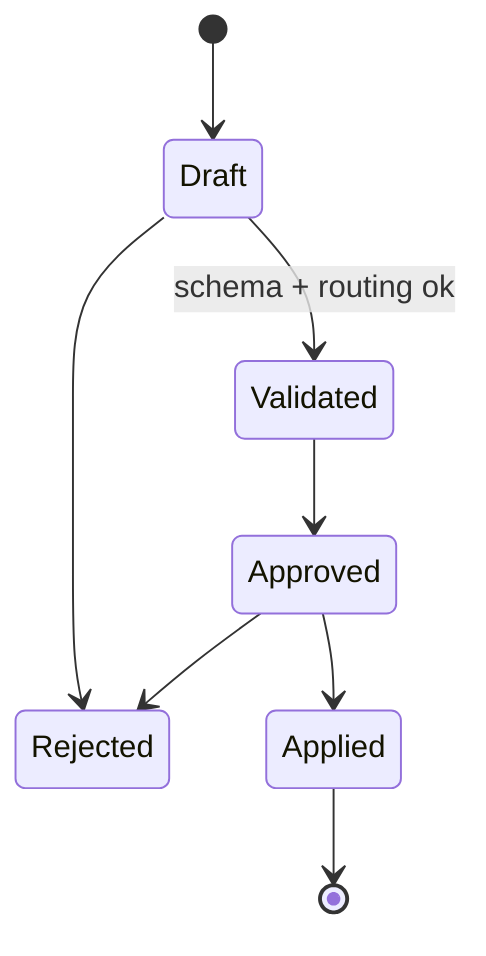

# KMV Console — System Design

> Implementation-ready, standards-aligned, and testable. Source of truth: `requirements.md`. This document is explicit about choices/constraints, and stays within scope. All content follows markdownlint-friendly formatting.

---

## 1. Context & Goals

### 1.1 Problem & Constraints

- Single-user, **local-first** knowledge management console that governs a Markdown vault with YAML SSOT (`routing.yaml`) and an **auditable** change pipeline.
- **No Git**; all writes pass **PROPOSAL → Approve/Reject → Apply**. Enhancements are **body-only**.
- Post-Apply **health checks** are event-driven, proposal-only, and cancellable.
- Atomic multi-file **Apply bundles**, idempotent by `bundle_hash`, with **post-Apply validation**.
- Immutable **audit JSONL** with hash chaining and origins: `prompt | refinement | enhancement | health_check`.
- **Secrets security**: AES-256-GCM at rest; key via **Argon2id**. Never log secrets.
- **File safety**: path normalization, traversal/symlink rejection, and temp+rename atomicity.
- **Performance targets**: Prompt→PROPOSAL p50 ≤ 10 s / p90 ≤ 20 s; Apply ≈ ≤ 1 s/file (≤ 64 KB); Reindex 5k ≤ 30 s full / ≤ 5 s incremental.
- **Accessibility**: WCAG 2.1 AA baseline (2.2 deltas acknowledged).
- **Undo**: last 3 actions (bundle-aware), with precondition checks.

### 1.2 Explicit Non-Goals

- Multi-tenant cloud or collaboration features.  
- Git integration.  
- GDPR features in v1 (consent portals, DSAR tooling), beyond local privacy controls.  
- Offline **queueing** of prompts (prompts require live LLM; show offline state instead).

---

## 2. Architecture Views (C4-Inspired, Concise)

### 2.1 Context View

- **Actors:** User (owner), LLM Provider (remote), Local Filesystem (vault).
- **System Boundary:** Single-machine app hosting a local web UI and API with filesystem adapters and a crypto keystore.



### 2.2 Container View

- **UI:** Next.js/React (SPA), accessibility-first.  
- **API:** Node/Express with typed contracts (TypeScript), JSON over HTTP.  
- **Adapters:** LLM, FS, Crypto/KeyStore.  
- **Data Stores:** `routing.yaml`, `vault.json`, Markdown files, `audit.log` (JSONL), `settings.json` (encrypted fields), `undo.log`.



### 2.3 Component View (Services)

Each service lists **I/O contracts**, **happy path**, **failure modes**, **timeouts**, **idempotency**, and **observability**.

#### 2.3.0 Prompt Refinement Service

- **In:** `PromptRefinementInput` (goal, optional contextRefs, lens weights).  
- **Out:** `RefinedPromptV1` and `StudyPlanV1` (no writes).  
- **Happy path:** Apply the curriculum-architect template; strict-parse outputs; format-repair loop (≤ 2); return structured plan and refined prompt.  
- **Failure modes:** `LLM_TIMEOUT`, `LLM_429`, `LLM_MALFORMED`.  
- **Timeouts:** 8 s (p50) / 16 s (p90).  
- **Idempotency:** Deterministic by `{goal, weights, template_version}` hash for observability only.  
- **Observability:** `refinement_latency`, `plan_size`, `weights`.

#### 2.3.0 Prompt Refinement Service – Detailed Specification

- Purpose: Pre-proposal refinement that converts a raw learning goal into a structured StudyPlanV1 and RefinedPromptV1 for upstream Proposal generation.
- Scope: Runs before Proposal service; does not write to vault; outputs are advisory only.
- Input: PromptRefinementInput (goal, contextRefs, lensWeights) as defined in contracts.
- Outputs: RefinedPromptV1 and StudyPlanV1 as defined in contracts; optional module routing_suggestions.
- Lifecycle: Stateless; two repair attempts max; deterministic output via input hash and templateVersion.
- Endpoints: POST /refine returns { refinedPrompt, studyPlan }.
- Behavior flag: autoStripAdditionalProps (bool). If enabled per-request or via env REFINE_AUTO_STRIP_ADDITIONAL_PROPS, the service strips any additionalProperties from LLM outputs and, if the sanitized payloads validate, returns them without error.
- DataModels: See contracts/PromptRefinementInput.schema.json, RefinedPromptV1.schema.json, StudyPlanV1.schema.json.
- Validation: Outputs validated against strict schemas; if validation fails, provide repair guidance; on second failure, report error unless autoStripAdditionalProps produces a valid sanitized result.
- Weights/Lenses: Weights influence refinement output; persisted for audit.
- Observability: metrics refine_latency_ms, plan_size_chars, refined_text_size, weights_distribution, success_rate.
- Security: ephemeral results; do not persist in vault; redact sensitive fields in logs.
- UI/UX: Two-pane UI (Study Plan left, Refined Prompt right) with weights sliders and a review step before Proposal generation.
- Governance: refinement events logged with origin=refinement in Audit; linked to subsequent Proposal.
- Testing: unit tests for input validation, repair, and auto-strip pathway; integration tests for /refine flow; performance testing to meet budgets.
- Cross-links: reference to contracts for PromptRefinementInput, RefinedPromptV1, StudyPlanV1.

#### 2.3.1 Proposal Service

- **In:** `{ prompt: string, contextRefs?: string[] }`  
- **Out:** `ProposalV1` (see §3.1).  
- **Happy path:** Calls LLM; strict-parse to schema; **format-repair loop** (≤ 2 attempts) within overall p90 budget; compute `proposal_hash` over canonicalized JSON.  
- **Failure modes:** `LLM_TIMEOUT`, `LLM_429`, `LLM_MALFORMED` (retryable with capped backoff).  
- **Timeouts:** LLM call deadline 8 s (p50), 16 s (p90).  
- **Idempotency:** By prompt fingerprint + normalized context + model version → used for observability only (no dedup of proposals).  
- **Observability:** `correlation_id`, `proposal_id`, `proposal_hash`, timings, retry_count, provider_code.

#### 2.3.2 Validation Service

- **In:** `ProposalV1`, `routing.yaml`, `vault.json`  
- **Out:** `ValidationReport` (see §3.2).  
- **Happy path:** Schema check → route match → path policy → neighbor/link existence → enhancement is body-only.  
- **Failure modes:** `SCHEMA_INVALID`, `ROUTING_MISMATCH`, `PATH_COLLISION`.  
- **Timeouts:** 300 ms typical; 2 s cap.  
- **Idempotency:** Pure function (no state).  
- **Observability:** `proposal_hash`, `ruleId`s, counts {errors,warnings}.

#### 2.3.3 Apply (Bundle) Service

- **In:** `{ bundle: ApplyBundleV1, proposal_hash }` (see §3.3).  
- **Out:** `ApplyReceipt[]` (one per affected file).  
- **Happy path:** Acquire per-path locks → temp-write → `fsync(file)` → `fsync(tmp_dir)` → `rename(tmp→final)` on same device → `fsync(parent_dir)` → post-Apply validation → update `vault.json` incrementally → append `audit.log` → enqueue health-check event.  
- **Failure modes:** `FS_NO_SPACE`, `FS_PERMISSION`, `PATH_COLLISION`, `CONFIG_CORRUPT`.  
- **Timeouts:** ≤ 1 s/file (≤ 64 KB).  
- **Idempotency:** De-duplicate by `bundle_hash` + `content_hash` per action.  
- **Observability:** `bundle_hash`, per-file `content_hash`, bytes_written, fsync_durations, post_validate_status.

#### 2.3.4 Inventory Service

- **In:** scan request (full or incremental)  
- **Out:** updated `vault.json` entries with `{path,title,topic,status,tags,mtime,size,content_hash}`.  
- **Happy path:** Full scan ≤ 30 s @ 5k files; incremental watcher ≤ 5 s. Near-duplicate hints (title n-gram cosine + slug Levenshtein ≥ 0.82 and same topic).  
- **Failure modes:** `FS_PERMISSION`, `CONFIG_CORRUPT`.  
- **Observability:** files_per_sec, changed_count, duplicate_candidates.

#### 2.3.5 Health Check Orchestrator

- **In:** events after successful Apply; coalesced within 2 s.  
- **Out:** one or more **Health PROPOSALs** (no writes).  
- **Happy path:** Analyze changed paths + inbound/outbound neighbors; detect link gaps/orphans, neighbor rewrite opportunities, and topic sprawl vs route/filename.  
- **Failure modes:** Cancelled (new prompt/Apply), time budget exceeded.  
- **Timeouts:** Time-sliced worker; cooperative cancellation.  
- **Idempotency:** Health proposals carry `origin=health_check` and a deterministic `proposal_hash` per analyzed window.  
- **Observability:** detections {broken_links, orphans, sprawl_hits}, thresholds, affected_paths.

#### 2.3.6 Audit Service

- **In:** events `{origin, justification, bundle_map, prev_hash}`  
- **Out:** append-only JSONL with `record_hash` linking previous (`prev_hash`).  
- **Observability:** chain_verification_ok, append_latency, fsync_ok.

#### 2.3.7 Settings Service

- **In/Out:** read/write `settings.json` with encrypted fields; provider connectivity test.  
- **Failure modes:** `CONFIG_CORRUPT`, `FS_PERMISSION`.  
- **Observability:** encryption_version, kdf_params, test_call_status.

### 2.4 Operational View (Key Sequences)



Optional pre-step (Refinement):



### 2.5 Deployment View (Local)

- **Mode A — Local web server (v1):** UI served at `localhost`; keys derived at runtime and stored in a user-accessible config folder with restricted permissions. Native OS pickers via browser file input APIs.  
- **Mode B — Desktop shell (deferred):** Would enable better key handling (OS keychain) and system file pickers. ADR in §12.

---

## 3. Critical Contracts & Schemas (Normative)

> All schemas are strict for Ajv; unknown keys rejected.

### 3.0 Prompt Refinement Contracts

#### 3.0.1 `PromptRefinementInput`

```json
{
  "$id": "https://kmv.local/schemas/PromptRefinementInput.json",
  "type": "object",
  "additionalProperties": false,
  "required": ["goal"],
  "properties": {
    "goal": { "type": "string", "minLength": 8 },
    "contextRefs": {
      "type": "array",
      "items": { "type": "string" },
      "maxItems": 8
    },
    "lensWeights": {
      "type": "object",
      "additionalProperties": false,
      "patternProperties": {
        "^[a-zA-Z0-9_\\-]{2,32}$": { "type": "number", "minimum": 0, "maximum": 1 }
      }
    }
  }
}
```

Field semantics — PromptRefinementInput

- goal: Human-stated learning objective. Must be specific enough to scope the plan; min 8 chars. Producer: user. Consumer: Prompt Refinement Service (PRS). Used to seed the curriculum template.
- contextRefs: Optional anchor materials (vault-relative note paths or external URIs) that the PRS may consult or reference. Capped to 8 to reduce drift and latency.
- lensWeights: Objective weightings per lens key (e.g., tutor, publisher, student). Values ∈ [0,1]; UI should normalize to sum≈1 though schema does not enforce sum. Used to bias the refinement output.

#### 3.0.2 `RefinedPromptV1`

```json
{
  "$id": "https://kmv.local/schemas/RefinedPromptV1.json",
  "type": "object",
  "additionalProperties": false,
  "required": ["version", "goal", "refinedText", "weights", "templateVersion"],
  "properties": {
    "version": { "const": 1 },
    "goal": { "type": "string", "minLength": 8 },
    "refinedText": { "type": "string", "minLength": 8 },
    "weights": {
      "type": "object",
      "additionalProperties": false,
      "patternProperties": {
        "^[a-zA-Z0-9_\\-]{2,32}$": { "type": "number", "minimum": 0, "maximum": 1 }
      }
    },
    "templateVersion": { "type": "string", "minLength": 1 }
  }
}
```

Field semantics — RefinedPromptV1

- version: Contract version pin for forward-compat checks. Must equal 1.
- goal: Echo of the original learning objective (post-cleanup), for traceability and audit diffs.
- refinedText: Final LLM-facing prompt text, shaped by the study plan and lens weights. This is passed to Proposal Service.
- weights: Effective lens weights used to produce this refined prompt. Persisted for audit and reproducibility.
- templateVersion: Identifier of the refinement recipe/template used (e.g., curriculum-architect-v1) to ensure reproducibility.

#### 3.0.3 `StudyPlanV1`

```json
{
  "$id": "https://kmv.local/schemas/StudyPlanV1.json",
  "type": "object",
  "additionalProperties": false,
  "required": ["version", "goal", "modules"],
  "properties": {
    "version": { "const": 1 },
    "goal": { "type": "string", "minLength": 8 },
    "modules": {
      "type": "array",
      "minItems": 1,
      "items": {
        "type": "object",
        "additionalProperties": false,
        "required": ["title", "description", "topics", "resources"],
        "properties": {
          "title": { "type": "string", "minLength": 3 },
          "description": { "type": "string", "minLength": 8 },
          "topics": {
            "type": "array",
            "items": { "type": "string" },
            "minItems": 1
          },
          "resources": {
            "type": "array",
            "items": { "type": "string", "format": "uri" },
            "maxItems": 12
          }
        }
      }
    }
  }
}
```

Field semantics — StudyPlanV1

- version: Contract version pin; must equal 1.
- goal: Echo of the learning goal; aligns with RefinedPromptV1.goal.
- modules[].title: Human-readable module name; becomes candidate H1 for generated notes.
- modules[].description: Scope and intent of the module; used to generate rationales and tags.
- modules[].topics: Canonical terms/subjects the module covers; map to routing topics/folders.
- modules[].resources: Curated, bounded list of reference links; informs related_links and future reading.

#### 3.1 `ProposalV1`

```json
{
  "$id": "https://kmv.local/schemas/ProposalV1.json",
  "type": "object",
  "additionalProperties": false,
  "required": ["version", "id", "target", "frontmatter", "body", "governance", "hash", "origin"],
  "properties": {
    "version": { "const": 1 },
    "id": { "type": "string", "minLength": 8, "pattern": "^[a-z0-9\\-]{8,}$" },
    "origin": { "type": "string", "enum": ["prompt", "enhancement", "health_check"] },
    "target": {
      "type": "object",
      "additionalProperties": false,
      "required": ["route_id", "path"],
      "properties": {
        "route_id": { "type": "string", "minLength": 1 },
        "path": { "type": "string", "pattern": "^(?!.*\\.{2})(?!\\s)(?!.*\\s$)[^\\0]+\\.md$" }
      }
    },
    "frontmatter": {
      "type": "object",
      "additionalProperties": false,
      "required": ["title", "status"],
      "properties": {
        "title": { "type": "string", "minLength": 3 },
        "status": { "type": "string", "enum": ["draft", "in-progress", "review", "published", "archived"] },
        "tags": { "type": "array", "items": { "type": "string" }, "maxItems": 24 },
        "aliases": { "type": "array", "items": { "type": "string" }, "maxItems": 8 }
      }
    },
    "body": {
      "type": "object",
      "additionalProperties": false,
      "required": ["content_md"],
      "properties": {
        "content_md": { "type": "string", "minLength": 1 }
      }
    },
    "governance": {
      "type": "object",
      "additionalProperties": false,
      "required": ["related_links", "rationale"],
      "properties": {
        "related_links": { "type": "array", "items": { "type": "string" } },
        "rationale": { "type": "string", "minLength": 1 }
      }
    },
    "hash": { "type": "string", "pattern": "^[a-f0-9]{64}$" }
  }
}
```

Field semantics — ProposalV1

- version: Contract version pin; must equal 1.
- id: Client- or server-generated unique identifier (slug-safe). Used for correlation and audit lookups.
- origin: Provenance of the proposal (prompt/enhancement/health_check) for audit segmentation and UX labeling.
- target.route_id: Identifier of the matched routing rule; aids traceability of path decisions.
- target.path: Final markdown path within the vault; sanitized, no traversal, `.md` enforced.
- frontmatter.title: H1/title for the note; must match content body’s H1 on Apply.
- frontmatter.status: Lifecycle state; governs visibility/workflows.
- frontmatter.tags: Discovery and governance tags; capped for precision.
- frontmatter.aliases: Alternate slugs/titles for backlink resolution.
- body.content_md: Markdown payload (excluding frontmatter); enhancements must change body only.
- governance.related_links: Outbound references for discovery/dup detection.
- governance.rationale: Human-readable justification for creation/update; required for audit.
- hash: SHA-256 over canonicalized proposal for idempotency and replay safety.

#### 3.2 `ValidationReport`

```json
{
  "$id": "https://kmv.local/schemas/ValidationReport.json",
  "type": "object",
  "additionalProperties": false,
  "required": ["ok", "matched_route_id", "errors"],
  "properties": {
    "ok": { "type": "boolean" },
    "matched_route_id": { "type": "string" },
    "errors": {
      "type": "array",
      "items": {
        "type": "object",
        "additionalProperties": false,
        "required": ["code", "path", "message", "severity"],
        "properties": {
          "code": { "type": "string" },
          "path": { "type": "string" },
          "message": { "type": "string" },
          "severity": { "type": "string", "enum": ["error", "warning"] },
          "ruleId": { "type": "string" }
        }
      }
    }
  }
}
```

Field semantics — ValidationReport

- ok: Aggregate gate; false if any error-level issues are present.
- matched_route_id: The route that matched the proposal path; aids UX explanations and governance checks.
- errors[].code: Machine-readable code (e.g., SCHEMA_INVALID, ROUTING_MISMATCH) for UI remediation mapping.
- errors[].path: JSON Pointer or field path indicating where the issue occurred.
- errors[].message: Human-readable explanation suitable for UI.
- errors[].severity: error blocks approval; warning permits proceed with caution.
- errors[].ruleId: Optional internal rule identifier for telemetry and docs linking.

#### 3.3 `ApplyBundleV1`

```json
{
  "$id": "https://kmv.local/schemas/ApplyBundleV1.json",
  "type": "object",
  "additionalProperties": false,
  "required": ["bundle_hash", "actions"],
  "properties": {
    "bundle_hash": { "type": "string", "pattern": "^[a-f0-9]{64}$" },
    "actions": {
      "type": "array",
      "minItems": 1,
      "items": {
        "type": "object",
        "additionalProperties": false,
        "required": ["op", "path"],
        "properties": {
          "op": { "type": "string", "enum": ["create", "modify", "delete", "link"] },
          "path": { "type": "string", "pattern": "^(?!.*\\.{2})[^\\0]+$" },
          "content": { "type": "string" },
          "link_target": { "type": "string" },
          "content_hash": { "type": "string", "pattern": "^[a-f0-9]{64}$" }
        }
      }
    }
  }
}
```

Field semantics — ApplyBundleV1

- bundle_hash: Deterministic hash of the intended bundle; used for idempotency and observability.
- actions[].op: Operation type — create/modify/delete/link. Only create/modify may provide content.
- actions[].path: Target path. Must be normalized within vault; traversal and NUL rejected.
- actions[].content: New file payload (for create/modify). Must embed frontmatter + body on create.
- actions[].link_target: Destination path for link operations; used to create or update links.
- actions[].content_hash: Optional content integrity guard for modify; prevents blind overwrites.

#### 3.4 `AuditRecord`

```json
{
  "$id": "https://kmv.local/schemas/AuditRecord.json",
  "type": "object",
  "additionalProperties": false,
  "required": ["ts", "origin", "justification", "bundle_map", "prev_hash", "record_hash"],
  "properties": {
    "ts": { "type": "string", "format": "date-time" },
    "origin": { "type": "string", "enum": ["prompt", "enhancement", "health_check"] },
    "justification": { "type": "string" },
    "bundle_map": { "type": "object" },
    "prev_hash": { "type": "string", "pattern": "^[a-f0-9]{64}$" },
    "record_hash": { "type": "string", "pattern": "^[a-f0-9]{64}$" }
  }
}
```

Field semantics — AuditRecord

- ts: Event timestamp (UTC, ISO 8601). Must reflect append time after fsync to ensure ordering.
- origin: Event class for audit segmentation (e.g., prompt/enhancement/health_check). If refinement events are introduced, extend enum accordingly.
- justification: Human rationale for the action (why it was applied or proposed).
- bundle_map: Opaque map linking bundle actions to paths and receipts; used by verifiers.
- prev_hash: Chain pointer to previous record; ensures tamper-evident log.
- record_hash: Current record hash; verifier recomputes and checks chain integrity.

#### 3.5 `vault.json` Entry

```json
{
  "$id": "https://kmv.local/schemas/VaultEntry.json",
  "type": "object",
  "additionalProperties": false,
  "required": ["path", "title", "topic", "status", "tags", "mtime", "size", "content_hash"],
  "properties": {
    "path": { "type": "string" },
    "title": { "type": "string" },
    "topic": { "type": "string" },
    "status": { "type": "string", "enum": ["draft", "in-progress", "review", "published", "archived"] },
    "tags": { "type": "array", "items": { "type": "string" } },
    "mtime": { "type": "integer" },
    "size": { "type": "integer" },
    "content_hash": { "type": "string", "pattern": "^[a-f0-9]{64}$" }
  }
}
```

Field semantics — VaultEntry

- path: Vault-relative file path. Serves as the primary key for entries.
- title: Note title; typically mirrors frontmatter title/H1.
- topic: Routing topic classification; aligns with `routing.yaml` rules.
- status: Note lifecycle state; governs workflow and visibility.
- tags: Supplemental classification for discovery and governance.
- mtime: Last modification time (epoch seconds). Used for incremental indexing.
- size: File size in bytes. Useful for performance heuristics.
- content_hash: SHA-256 over normalized file content; enables idempotency and undo safety checks.

---

## 4. File Safety & Concurrency

### 4.1 Atomic Write Algorithm

1. Resolve a normalized absolute path within the vault; reject traversal (`..`) and symlinks.  
2. Write to `vault/.tmp/<uuid>`; call `fsync(file)`.  
3. `fsync(vault/.tmp)`; POSIX `rename(tmp, final)` on **same device** for atomicity.  
4. `fsync(parent_dir)` after rename.  
5. On any failure: remove temp; **no partial writes**.

> POSIX `rename()` is atomic on the same filesystem; cross-device renames are **rejected** and fall back to copy+fsync+replace only if explicitly allowed by a future ADR.

### 4.2 Locking

- **Per-path lock files:** `vault/.locks/<sha256(path)>.lock` created with `O_EXCL`.  
- **Inventory lock:** `vault/.locks/inventory.lock` during full reindex.  
- **Crash cleanup:** Locks older than 10 minutes are reclaimable with a warning in audit.

### 4.3 Path Hygiene

- Normalize to absolute within vault root.  
- Reject traversal (`..`), symlinks, device boundaries.  
- Deny non-UTF-8 paths and NUL bytes.  
- Enforce `.md` extension for content files.

### 4.4 Idempotency Rules

- Apply de-duplicates per `{bundle_hash, path, content_hash}`.  
- Re-applying an identical bundle returns prior receipts without new writes.

---

## 5. Health Checks: Design & Governance

- **Event loop:** Triggered **after** successful Apply; coalesce events in a 2 s window.  
- **Cancellation:** Any new Prompt/Apply cancels pending or running checks; they reschedule after the next change.  
- **Scope:** Changed paths + neighbors via link graph (inbound/outbound).  
- **Detections:**  
  - Link graph gaps/orphans (missing targets, broken backlinks).  
  - Neighbor rewrite suggestions (extract/split; relink to improve cohesion).  
  - **Topic sprawl** vs filename/route thresholds (defaults):  
    - File size > 64 KB, or  
    - Headings > 12, or  
    - Distinct topic heuristics > 2, or  
    - Outbound links > 50.  
  All thresholds are configurable.

- **Outputs:** One or more **Health PROPOSALs** with reasons, thresholds hit, affected paths, and impact summary.  
- **No writes:** Health checks produce proposals **only**; standard approval gate applies.

---

## 6. Error Taxonomy & UX Remediation

| Code             | Class        | Retry | Typical Cause                   | UI Remediation                                                                 |
|------------------|-------------:|:-----:|----------------------------------|---------------------------------------------------------------------------------|
| SCHEMA_INVALID   | USER_INPUT   |  No   | Proposal fails schema            | Show failing JSON pointers; offer auto-repair preview; block Approve           |
| ROUTING_MISMATCH | USER_INPUT   |  No   | No route matches `path`          | Show matched candidates; suggest `routing.yaml` snippet for approval           |
| PATH_COLLISION   | USER_INPUT   |  No   | Target exists without override   | Suggest slug variants; allow explicit modify with diff                         |
| FS_NO_SPACE      | SYSTEM       |  No   | Disk full                        | Show required/free bytes; pause and retry after user frees space               |
| FS_PERMISSION    | SYSTEM       |  No   | Insufficient write permissions   | Explain which directory failed; link to docs; re-test after user fixes         |
| CONFIG_CORRUPT   | SYSTEM       |  No   | Bad `settings.json`/`routing`    | Open recovery wizard; validate & re-save; keep backups                         |
| LLM_TIMEOUT      | PROVIDER     | Yes   | Network latency/provider slowness| Exponential backoff (max 2); show estimated wait; allow cancel                 |
| LLM_429          | PROVIDER     | Yes   | Rate limiting                    | Backoff with jitter; display retry-after if provided                           |
| LLM_MALFORMED    | PROVIDER     | Yes   | Non-conforming output            | Run format-repair loop; if still failing, show raw + copy-to-clipboard button  |

---

## 7. Security & Privacy

### 7.1 Secrets at Rest

- **Cipher:** AES-256-GCM with random 96-bit nonce; store nonce + auth tag alongside ciphertext.  
- **KDF:** **Argon2id** with parameters defaults: `m=64 MiB`, `t=3`, `p=1`, unique 128-bit salt per vault. Parameters stored in `settings.json` metadata.  
- **Rotation:** Passphrase rotation re-encrypts all protected fields; old passphrase invalidated.  
- **Redaction:** Secrets never logged; UI/logs redact values.  

### 7.2 OWASP Alignment (Selected Controls)

- **Input handling / schema validation:** Strict Ajv for all contracts.  
- **Error handling/logging:** No stack leaks to UI; structured logs with codes only.  
- **Data protection at rest:** AES-GCM as above; key derived by Argon2id.  
- **Session hygiene:** Local inactivity lock (configurable); no telemetry by default.  

### 7.3 Threats & Mitigations (STRIDE-Lite)

- **Symlink/path traversal:** Reject symlinks and `..`; enforce normalized absolute paths.  
- **Partial writes:** Temp+rename on same device with fsyncs.  
- **Proposal tampering:** Audit hash chain; proposals hashed and recorded.  
- **LLM prompt injection:** Output strict parsing + format-repair + rule-bound routes.  
- **Replay of bundles:** Idempotency rules on `bundle_hash` + `content_hash`.

### 7.4 Key Storage Implications

- **Local web server (v1):** Encrypted `settings.json` in user config directory with OS file permissions.  
- **Desktop shell (deferred):** Optionally store keys in OS keychain (ADR to evaluate).

---

## 8. Accessibility & UX Standards

- **Baseline:** WCAG 2.1 AA.  
- **WCAG 2.2 deltas to adopt where applicable:** stronger focus appearance, reduced pointer drag dependence, and consistent target sizes for controls.  
- **Automation:** Integrate axe-core checks in CI; announce validation outcomes via ARIA live regions; maintain focus order and visible focus.  
- **Keyboard-first UX:** All actions (Approve/Reject/Apply/Undo) fully keyboard-operable.

---

## 9. Observability & SLIs

- **Structured logs (JSON):** `ts, correlation_id, proposal_id, proposal_hash, action, code, outcome, duration_ms`.  
- **SLIs:**  
  - Prompt→Proposal latency (p50/p90)  
  - Apply success rate  
  - Validation failure rate (user vs system)  
  - Reindex throughput (files/sec)  
  - Health-check turnaround (event→proposal)  
  - Prompt refinement latency (p50/p90)
- **Diagnostics export:** Redacted `settings.json`, `routing.yaml`, latest `vault.json`, `audit.log` tail, environment snapshot (app version, node version, OS).

---

## 10. Performance Engineering & Test Plan

- **Budgets:** Honor targets in §1.1. Health checks are time-sliced and cancellable to stay responsive.  
- **Test harness:**  
  - **Contracts:** Valid/invalid fixtures for all schemas (Ajv).  
  - **Property tests:** Apply idempotency (re-run bundles); atomic write chaos (kill between temp/rename).  
  - **Error-path tests:** Each error code triggers correct remediation text.  
  - **Accessibility smoke:** axe-core and screen-reader announcement checks.  
  - **Audit verifier CLI:** Recompute hash chain end-to-end.  
  - **Perf:** Synthetic prompts and file trees to assert p50/p90 and 5k-file reindex.

---

## 11. Traceability Matrix

| Requirement | Design Sections | Tests / Hooks | Observability |
|---|---|---|---|
| Local-first, no Git | §1, §2.5 | E2E offline read/write; no Git deps | app_mode, telemetry=off |
| PROPOSAL→Approve→Apply | §2.3.1–§2.3.3, §2.4 | Contract fixtures; e2e happy path | proposal_hash, action=APPLY |
| Transactional bundles | §2.3.3, §3.3, §4 | Atomic write chaos tests | bundle_hash, bytes_written |
| Idempotency on bundles | §2.3.3, §4.4 | Property tests | bundle_hash, content_hash |
| Health checks proposal-only | §2.3.5, §5 | HC unit/e2e; cancellation | origin=health_check, hc_latency |
| Enhancement body-only | §2.4, §3.1 | Validator forbids FM change | ruleId=FM_UNCHANGED |
| Audit JSONL + hash chain | §2.3.6, §3.4, §10 | CLI verifier | record_hash, chain_ok |
| Secrets: AES-GCM + Argon2id | §7 | KDF params test; decrypt/encrypt | encryption_version |
| File safety: temp+rename | §4 | Chaos tests | fsync_ok, rename_ok |
| Performance targets | §1.1, §10 | Perf harness | latency_p50/p90 |
| Accessibility (2.1 AA) | §8 | Axe CI | a11y_checks_pass |
| Undo (3, bundle-aware) | §0.2, §6 | Undo precondition tests | undo_available |

> Any requirement not explicitly covered would be marked here as a gap (none identified beyond deferred ADRs).

---

## 12. Architecture Decisions (Pointers)

- **ADR-001 UI Framework:** Next.js/React SPA; consequence: strong accessibility ecosystem and component reuse.  
- **ADR-002 Local API:** Node/Express with TypeScript; consequence: unified language and rich FS libs.  
- **ADR-003 Secrets:** Argon2id → AES-256-GCM; consequence: modern KDF and AEAD with integrity.  
- **ADR-004 Apply Atomicity:** POSIX temp+fsync+rename on same device; consequence: safe against partial writes.  
- **ADR-005 Audit Store:** Append-only JSONL with hash chain; consequence: human-readable, verifiable without DB.  
- **ADR-006 Undo Model:** Bundle-aware inverse ops with precondition checks; consequence: safe, bounded complexity.  
- **ADR-007 Offline Queueing:** Not supported; consequence: simpler invariants, clearer UX.  
- **ADR-008 Desktop Shell:** Deferred; consequence: keep web server simplicity; revisit for OS keychain integration.

---

## 13. Risks & Mitigations

- **LLM variance:** Strict schema parsing + repair loop; cap retries; surface raw with copy.  
- **Filesystem semantics across OSes:** Treat symlinks/traversal uniformly; reject cross-device renames; comprehensive tests.  
- **Large vault scalability:** Time-sliced health checks; incremental indexing; consider lightweight DB if > 5k files (ADR).  
- **Performance tail risks:** Backpressure UI; cancel in-flight health checks; show progress.  
- **User bypass edits:** Reindex on focus/interval; warnings when external edits diverge from inventory.  

---

## 14. Diagrams (Mermaid)

### 14.1 Context



### 14.2 Sequence (Prompt→…→Reindex)



### 14.3 State (Proposal)



---

## 15. Standards & References Consulted

- **OWASP ASVS** (crypto, logging, input handling): apply schema validation, error handling, and cryptographic storage practices.  
- **WCAG 2.1 AA baseline; 2.2 deltas**: adopt improved focus appearance, target sizes, reduced drag reliance.  
- **POSIX `rename()`** semantics: atomic on same filesystem; constrain design accordingly.  
- **Argon2id** recommendations for password-derived keys.

> These references inform the constraints and security/accessibility mappings in §4, §7, and §8.

---

## 16. Design Review Checklist

- [x] Satisfies all non-negotiable tenets (local-first; proposal-only flows; atomic bundles; health-check governance; audit chain; secrets; file safety; performance; accessibility; undo).  
- [x] Explicit about architectural choices, constraints, and tradeoffs.  
- [x] Includes contracts/schemas, failure modes, performance envelopes, and test hooks.  
- [x] Avoids scope creep; marks deferrals via ADR pointers.  
- [x] Conforms to markdownlint style (headings, fenced code blocks, tables).  
- [x] Includes traceability matrix and diagrams.

---

*Generated: 2025-09-25T17:20:10Z*

---

## 17. Routing YAML Data Model (Normative)

Top-level keys (all required): `conventions`, `schemas`, `routes`, `health_checks`, `acceptance`.

- conventions
  - `date_format: string` (e.g., YYYY-MM-DD)
  - `link_style: string` (e.g., wikilink | md)
  - `create_if_missing: boolean`
  - `status.default: string`, `status.allowed: string[]`
- schemas
  - `frontmatter.required: string[]`
  - `frontmatter.optional: string[]`
  - `frontmatter.enums.<field>: string[]`
  - `templates.<template_name>.required_sections: string[]` (optional)
- routes (array)
  - `id: string` (unique)
  - `pattern: string` (glob; normalized)
  - `topic: string` (lowercase kebab-case)
  - `template: string` (must be defined under `schemas.templates`)
  - Optional attributes: `tags: string[]`, `required_sections: string[]`, `examples_expected: boolean`, `require_code_block: boolean`, `notes: string[]`
- health_checks
  - `link_integrity: boolean`
  - `multi_topic_sprawl: { size_kb: number, max_headings: number, distinct_topics: number }`
  - `required_sections: [{ route: string, must_have: string[] }]`
- acceptance
  - `frontmatter_complete: boolean`
  - `title_matches_h1: boolean`
  - `body_min_length: number`

---

## 18. Routing YAML Generation Algorithm (Deterministic)

1) Discover inputs
   - Scan the vault for Markdown notes, parse frontmatter, compute metadata (path, title, tags, status, size, headings count).
   - Read organizational policies and defaults (conventions, allowed enums, templates).
2) Classify
   - For each note, find matching route candidates by `pattern`. Resolve conflicts by precedence (exactness or configured ordering).
   - Validate frontmatter against `schemas.frontmatter` and route template requirements.
3) Merge
   - Construct `routes` entries (if generating from discovery) or verify pre-existing routes cover all files.
   - Normalize topics, tags, and template references.
4) Validate
   - Run `health_checks` (link integrity, sprawl thresholds, required_sections) and global `acceptance` gates.
   - Accumulate findings with error codes. Abort on errors; produce advisory fixes on warnings.
5) Emit
   - Serialize routing.yaml with stable ordering (by `id`) and formatting rules. Re-run schema validation to assert idempotency.

Outputs: deterministic YAML (same inputs ⇒ same output), a `ValidationReport`-like summary, and optional auto-fix suggestions (not applied without approval).

---

## 19. Governance & Lifecycle (Versioning, Migration, Errors)

- Versioning
  - Include `version: semver` at the top-level when governance requires; changes to structure bump minor/major accordingly.
- Migration
  - Deprecate routes with a `notes` entry and provide a migration map (old pattern → new pattern) or indicate no-op when safe.
  - Migration proposals are emitted as PROPOSALs; no automatic file moves without approval.
- Error handling
  - Schema errors: fail with `ROUTING_SCHEMA_INVALID` and list JSON Pointers.
  - Validation failures: `ROUTING_DUPLICATE_ID`, `ROUTING_PATTERN_CONFLICT`, `ROUTING_TEMPLATE_UNKNOWN`, `ROUTING_REQUIRED_SECTIONS_MISSING`, `ROUTING_TAG_INVALID`.
  - Conflicts are resolved by explicit precedence or user approval of a remap.

---

## 20. Testing & Validation (Deterministic, Automated)

- Test vectors
  - Minimal routing.yaml (Appendix B) → MUST pass schema and produce zero warnings.
  - Overlapping patterns → MUST produce `ROUTING_PATTERN_CONFLICT`.
  - Missing template → `ROUTING_TEMPLATE_UNKNOWN`.
  - Required sections absent → `ROUTING_REQUIRED_SECTIONS_MISSING`.
- Coverage
  - Health-checks: link integrity (broken links), sprawl thresholds, and required_sections.
  - Acceptance: title/H1 match, frontmatter completeness, body length.
- Expected outputs
  - Machine-readable `ok: boolean`, `errors: []`, `warnings: []` with codes; stable output hash for idempotency.

---

## 21. Appendices (Shared)

### Appendix A — JSON Schema for routing.yaml

```json
{
  "$id": "https://kmv.local/schemas/RoutingYAML.json",
  "$schema": "http://json-schema.org/draft-07/schema#",
  "type": "object",
  "required": ["conventions","schemas","routes","health_checks","acceptance"],
  "additionalProperties": false,
  "properties": {
    "conventions": {
      "type": "object",
      "required": ["date_format","link_style","create_if_missing","status"],
      "additionalProperties": false,
      "properties": {
        "date_format": { "type": "string" },
        "link_style": { "type": "string", "enum": ["wikilink","md"] },
        "create_if_missing": { "type": "boolean" },
        "status": {
          "type": "object",
          "required": ["default","allowed"],
          "properties": {
            "default": { "type": "string" },
            "allowed": { "type": "array", "items": { "type": "string" }, "minItems": 1 }
          }
        }
      }
    },
    "schemas": {
      "type": "object",
      "required": ["frontmatter"],
      "properties": {
        "frontmatter": {
          "type": "object",
          "required": ["required","optional","enums"],
          "additionalProperties": false,
          "properties": {
            "required": { "type": "array", "items": { "type": "string" } },
            "optional": { "type": "array", "items": { "type": "string" } },
            "enums": { "type": "object", "additionalProperties": { "type": "array", "items": { "type": "string" } } }
          }
        },
        "templates": {
          "type": "object",
          "additionalProperties": { "type": "object", "properties": { "required_sections": { "type": "array", "items": { "type": "string" } } } }
        }
      }
    },
    "routes": {
      "type": "array",
      "minItems": 1,
      "items": {
        "type": "object",
        "required": ["id","pattern","topic","template"],
        "additionalProperties": true,
        "properties": {
          "id": { "type": "string", "minLength": 3 },
          "pattern": { "type": "string", "minLength": 3 },
          "topic": { "type": "string", "pattern": "^[a-z0-9\-]+$" },
          "template": { "type": "string" },
          "tags": { "type": "array", "items": { "type": "string" } },
          "required_sections": { "type": "array", "items": { "type": "string" } },
          "examples_expected": { "type": "boolean" },
          "require_code_block": { "type": "boolean" },
          "notes": { "type": "array", "items": { "type": "string" } }
        }
      }
    },
    "health_checks": {
      "type": "object",
      "required": ["link_integrity","multi_topic_sprawl","required_sections"],
      "properties": {
        "link_integrity": { "type": "boolean" },
        "multi_topic_sprawl": {
          "type": "object",
          "required": ["size_kb","max_headings","distinct_topics"],
          "properties": {
            "size_kb": { "type": "number", "minimum": 0 },
            "max_headings": { "type": "number", "minimum": 0 },
            "distinct_topics": { "type": "number", "minimum": 0 }
          }
        },
        "required_sections": {
          "type": "array",
          "items": {
            "type": "object",
            "required": ["route","must_have"],
            "properties": {
              "route": { "type": "string" },
              "must_have": { "type": "array", "items": { "type": "string" } }
            }
          }
        }
      }
    },
    "acceptance": {
      "type": "object",
      "required": ["frontmatter_complete","title_matches_h1","body_min_length"],
      "properties": {
        "frontmatter_complete": { "type": "boolean" },
        "title_matches_h1": { "type": "boolean" },
        "body_min_length": { "type": "number", "minimum": 0 }
      }
    }
  }
}
```

### Appendix B — Minimal vs Full routing.yaml (Neutral Examples)

Minimal:

```yaml
conventions:
  date_format: "YYYY-MM-DD"
  link_style: "wikilink"
  create_if_missing: true
  status:
    default: "draft"
    allowed: [draft, in-progress, review, published, archived]
schemas:
  frontmatter:
    required: [title, status]
    optional: [tags]
    enums: { status: [draft, in-progress, review, published, archived] }
routes:
  - id: topic/example
    pattern: "topic/example/*.md"
    topic: example
    template: study_note
health_checks:
  link_integrity: true
  multi_topic_sprawl: { size_kb: 64, max_headings: 12, distinct_topics: 2 }
  required_sections: []
acceptance:
  frontmatter_complete: true
  title_matches_h1: true
  body_min_length: 150
```

Full (illustrative):

```yaml
conventions:
  date_format: "YYYY-MM-DD"
  link_style: "md"
  create_if_missing: false
  status:
    default: "draft"
    allowed: [draft, in-progress, review, published, archived]
schemas:
  frontmatter:
    required: [title, status]
    optional: [tags, aliases]
    enums:
      status: [draft, in-progress, review, published, archived]
  templates:
    study_note: { required_sections: ["Summary","References"] }
    deep_dive:  { required_sections: ["Concepts","Decisions","References"] }
routes:
  - id: topic/example/overview
    pattern: "topic/example/overview/*.md"
    topic: example
    template: study_note
    tags: ["ref/overview"]
  - id: topic/example/deep
    pattern: "topic/example/deep/*.md"
    topic: example
    template: deep_dive
    required_sections: ["Concepts","Decisions","References"]
health_checks:
  link_integrity: true
  multi_topic_sprawl: { size_kb: 64, max_headings: 12, distinct_topics: 2 }
  required_sections:
    - { route: topic/example/deep, must_have: ["Concepts","Decisions","References"] }
acceptance:
  frontmatter_complete: true
  title_matches_h1: true
  body_min_length: 200
```

### Appendix C — Validation Error Codes

- `ROUTING_SCHEMA_INVALID` — YAML fails JSON Schema validation.
- `ROUTING_DUPLICATE_ID` — two or more routes share the same `id`.
- `ROUTING_PATTERN_CONFLICT` — ambiguous or overlapping patterns without precedence.
- `ROUTING_TEMPLATE_UNKNOWN` — route references an undefined template.
- `ROUTING_REQUIRED_SECTIONS_MISSING` — required sections not found in candidate note.
- `ROUTING_TAG_INVALID` — tag normalization or namespace violation.

### Appendix D — Evolution Rules

- Adding categories
  - Add new `routes` entries with unique `id` and non-overlapping `pattern`; dry-run validate across the vault.
- Deprecating routes
  - Mark with a `notes` entry and provide either a migration map or evidence of non-use.
- Template changes
  - Bump version and add migration notes for new required sections; provide a lint rule to surface missing sections.
- Policy changes
  - Update `conventions`/`schemas` and run full validation; require explicit approver sign-off when gates tighten.
