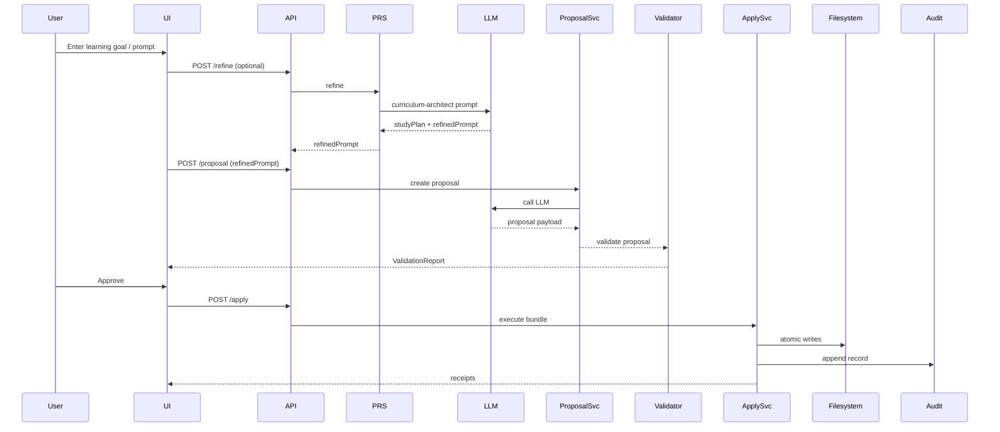
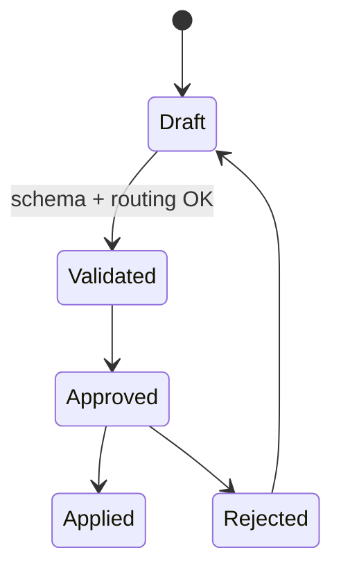

# KMV Console — Knowledge Management Vault

A local-first, single-user research console that combines LLM-assisted drafting with strict governance for a provable, auditable Markdown vault.

---

## In one sentence

KMV turns research prompts into schema-validated PROPOSALs, enforces routing-driven organization, performs atomic, auditable Applies, and continually advises healthy vault structure — all while keeping secrets local and workflows accessible.

---

## Why KMV (value proposition)

- Organize: enforce routing and schemas to prevent structure drift.
- Verify: immutable JSONL audit log with hash chaining gives provable history.
- Accelerate: optional prompt refinement + LLM-driven proposals raise quality and speed.
- Maintain: health checks detect sprawl and suggest safe refactors.
- Secure: local-first design, AES-GCM encryption and Argon2id KDF for keys.

Read product goals: [design/requirements.md](design/requirements.md)

---

## Quick pointers (where to look)

- Requirements (normative): [design/requirements.md](design/requirements.md)
- Implementation design: [design/system-design.md](design/system-design.md)
- JSON contracts (normative): `contracts/*.schema.json` (e.g. [contracts/ProposalV1.schema.json](contracts/ProposalV1.schema.json))
- Routing governance: [routing.yaml](routing.yaml)
- Local settings: [settings.json](settings.json)
- Prompt refinement recipe: [design/prompts/curriculum-architect-template.md](design/prompts/curriculum-architect-template.md)
- Super-prompt to regenerate design: [design/prompts/requirements-to-system-design.md](design/prompts/requirements-to-system-design.md)

---

## Functional overview (short)

KMV is composed of a UI (Next.js), a Local API (Node/Express), adapters (LLM, FS, Crypto), and on-disk artifacts (routing.yaml, vault.json, markdown files, audit.log, settings.json). The runtime flow is:

1. (Optional) Prompt Refinement → PRS → StudyPlanV1 + RefinedPromptV1
2. Proposal generation → ProposalV1
3. Validation → ValidationReport
4. Approve → ApplyBundle (atomic write) → receipts + audit
5. Post-Apply Health Checks → Health PROPOSALs (advisory)

See design for details: [design/system-design.md](design/system-design.md)

---

## Key concepts (short)

- Proposal: schema-validated change request (see `contracts/ProposalV1.schema.json`).
- Apply bundle: atomic set of file operations, idempotent by `bundle_hash`.
- Inventory: `vault.json` index (path/title/topic/status/tags/mtime/size/content_hash).
- Audit: append-only JSONL with record hashes and prev pointers.
- PRS: Prompt Refinement Service producing StudyPlanV1 + RefinedPromptV1.

---

## Diagrams (visualize the system)

### Architecture overview (simplified)

```mermaid
flowchart LR
  U[User / Researcher] --> UI[KMV UI (Next.js)]
  UI --> API[Local API (Node/Express)]
  API --> FS[(Vault Filesystem)]
  API --> LLM[LLM Provider]
  FS --> ROUTING[routing.yaml]
  FS --> VAULT[vault.json]
  VAULT --> AUDIT[audit.log]
  API --> CRYPTO[Crypto/Keystore]
```

### Core flow (sequence)



### State machine (proposal)



---

## How to start (developer focus)

1. Read contracts and write contract tests (Ajv fixtures) — this gives you a fast feedback loop.
2. Implement Proposal → Validation → Apply chain with small, testable increments.
3. Add inventory indexing and audit appenders; verify audit chain verifier.
4. Implement PRS and health-checks as advisory services.

See test plan and budgets: [design/system-design.md §10](design/system-design.md#10-performance-engineering--test-plan)

---

## Visual polish tips for README render on GitHub

- Mermaid diagrams render on GitHub; keep them concise.
- For static PNG/SVG alternatives (if needed), export Mermaid diagrams and place under `/docs/img/` and link them with standard Markdown image syntax.
- Keep README sections short; link to design and contracts for depth.

---

## Troubleshooting & support

- Routing mismatches: `routing.yaml` + `ValidationReport.ruleId`.
- Secrets issues: check `settings.json` encryption metadata and key derivation parameters.

---

## Where to contribute

- Contracts/schema changes: `contracts/` — update tests and design docs.
- Design and requirements: `design/requirements.md` and `design/system-design.md`.
- Prompt templates: `design/prompts/`.

---

