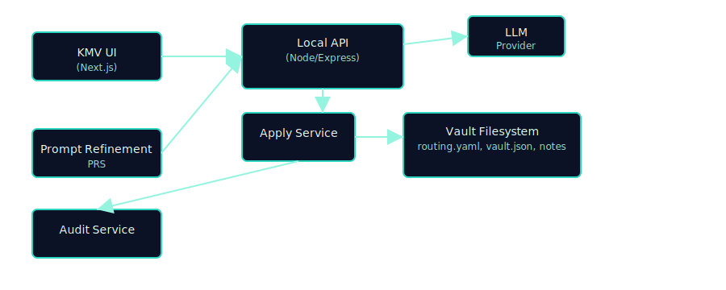
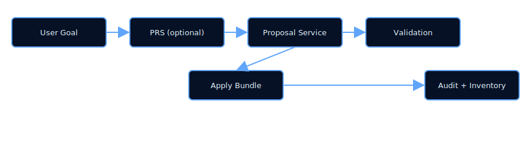
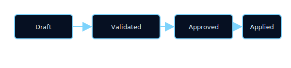

# KMV Console — Knowledge Management Vault

A local-first, single-user research console that combines LLM-assisted drafting with strict governance for a provable, auditable Markdown vault.

---

## In one sentence

KMV turns research prompts into schema-validated PROPOSALs, enforces routing-driven organization, performs atomic, auditable Applies, and continually advises healthy vault structure — all while keeping secrets local and workflows accessible.

---

## Why KMV (value proposition)

- Organize: enforce routing and schemas to prevent structure drift.
- Verify: immutable JSONL audit log with hash chaining gives provable history.
- Accelerate: optional prompt refinement + LLM-driven proposals raise quality and speed.
- Maintain: health checks detect sprawl and suggest safe refactors.
- Secure: local-first design, AES-GCM encryption and Argon2id KDF for keys.

Read product goals: [design/requirements.md](design/requirements.md)

---

## Quick pointers (where to look)

- **Requirements (normative):** [design/requirements.md](design/requirements.md)
- **System design (implementation-ready):** [design/system-design.md](design/system-design.md)
- **Component/service docs:** [design/components/](design/components/) — all major services, adapters, and flows are documented with actionable, testable specs and traceability tables.
- **JSON contracts (normative):** `contracts/*.schema.json` (e.g. [contracts/ProposalV1.schema.json](contracts/ProposalV1.schema.json))
- **Routing governance:** [routing.yaml](routing.yaml)
- **Local settings:** [settings.json](settings.json)
- **Prompt refinement recipe:** [design/prompts/curriculum-architect-template.md](design/prompts/curriculum-architect-template.md)
- **Component doc super-prompt:** [design/prompts/component-design-doc-prompt.md](design/prompts/component-design-doc-prompt.md)
- **System design super-prompt:** [design/prompts/requirements-to-system-design.md](design/prompts/requirements-to-system-design.md)
- **Implementation plan super-prompt:** [design/prompts/system-design-to-implementation-prompt.md](design/prompts/system-design-to-implementation-prompt.md)

---

## Functional overview (short)

KMV is composed of:

- **UI:** Next.js, accessibility-first, keyboard-driven, schema-validated flows.
- **Local API:** Node/Express, strict schema validation, error taxonomy, and dependency-injected adapters.
- **Adapters:** LLM (provider-agnostic), FS (atomic write, lock, symlink rejection), Crypto (Argon2id KDF, AES-GCM, KMS integration).
- **Artifacts:** routing.yaml, vault.json, markdown files, audit.log (JSONL hash chain), settings.json (encrypted).

### Core runtime flow

1. (Optional) Prompt Refinement → PRS → StudyPlanV1 + RefinedPromptV1
2. Proposal generation → ProposalV1
3. Validation → ValidationReport (strict error codes, traceability)
4. Approve → ApplyBundle (atomic, idempotent write) → receipts + audit
5. Post-Apply Health Checks → Health PROPOSALs (advisory, non-destructive)

See [system design](design/system-design.md) and [component docs](design/components/) for full details, algorithms, and traceability.

---

## Key concepts (short)

- **Proposal:** Schema-validated change request ([ProposalV1.schema.json](contracts/ProposalV1.schema.json)), canonicalized and hashed.
- **Apply bundle:** Atomic, idempotent set of file operations, lock-guarded, validated by `bundle_hash`.
- **Inventory:** `vault.json` index (path/title/topic/status/tags/mtime/size/content_hash), supports near-duplicate detection and incremental updates.
- **Audit:** Append-only JSONL with record hashes and prev pointers, chain-verifiable via CLI.
- **PRS:** Prompt Refinement Service producing StudyPlanV1 + RefinedPromptV1, curriculum-driven.
- **Validation:** Schema-first, pattern-matching, strict error taxonomy, traceable to requirements and design.
- **Health checks:** Event-coalesced, detector-driven, advisory-only proposals for vault hygiene.

---

## Diagrams (visualize the system)

### Architecture overview

### Core flow

### Proposal state

---

## How to start (developer focus)

1. **Read contracts and write contract tests** (Ajv fixtures) — fast feedback, schema-first.
2. **Implement Proposal → Validation → Apply chain** in small, testable increments; use strict error taxonomy and traceability.
3. **Add inventory indexing and audit appenders; verify audit chain** with the CLI verifier.
4. **Implement PRS and health-checks** as advisory services; ensure observability hooks and metrics.
5. **Use prompt templates** ([component](design/prompts/component-design-doc-prompt.md), [system design](design/prompts/requirements-to-system-design.md), [implementation plan](design/prompts/system-design-to-implementation-prompt.md)) to regenerate docs and specs as requirements evolve.

See [test plan and budgets](design/system-design.md#10-performance-engineering--test-plan) for performance, reliability, and coverage targets.

---

## Visual polish tips for README render on GitHub

- SVG diagrams are embedded for guaranteed rendering. Keep them concise and readable.
- If you edit diagrams, regenerate SVGs in `docs/img/` and update links above.
- Keep README sections short; link to design, contracts, and component docs for depth.

---

## Troubleshooting & support

- **Routing mismatches:** See `routing.yaml` and `ValidationReport.ruleId` for diagnostics.
- **Secrets issues:** Check `settings.json` encryption metadata and key derivation parameters; see [settings.md](design/components/settings.md) for crypto details.
- **Audit chain issues:** Use the audit verifier CLI ([scripts/verify-audit.js](scripts/verify-audit.js)) and check for hash chain integrity.

---

## Where to contribute

- **Contracts/schema changes:** `contracts/` — update tests, fixtures, and design docs.
- **Design and requirements:** [design/requirements.md](design/requirements.md), [design/system-design.md](design/system-design.md), [design/components/](design/components/).
- **Prompt templates:** [design/prompts/](design/prompts/) — use to regenerate docs and specs.
- **ADR and governance:** [design/adr/](design/adr/) — document architecture decisions and tradeoffs.

---

### Latest highlights

- All major components, services, and adapters are documented with actionable, implementation-ready specs and traceability tables.
- System design and implementation plan prompts ensure full coverage, testability, and supply-chain controls (SBOM, SLSA, provenance, CI gates).
- Strict markdownlint compliance and mermaid diagram compilation across all docs.
- Supply-chain and security controls: CycloneDX SBOM, SLSA provenance, secret scanning, branch protection, and ADRs for contract changes.

---
